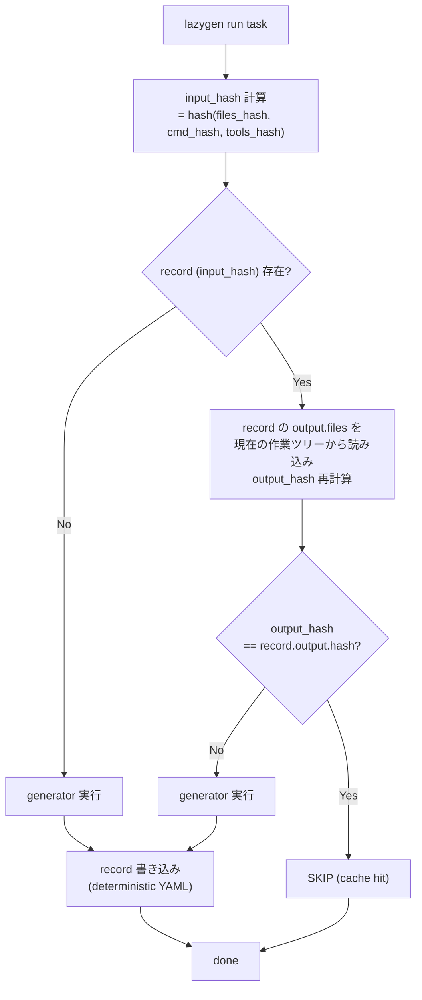
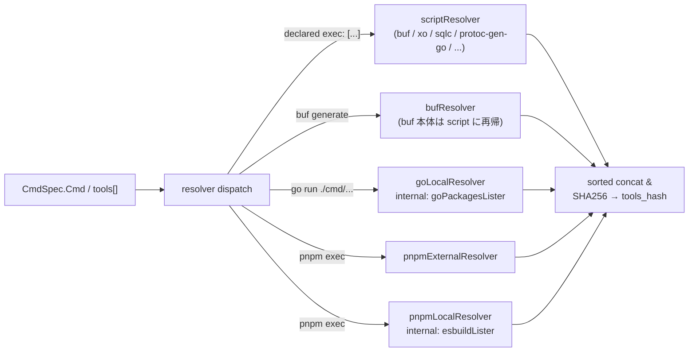
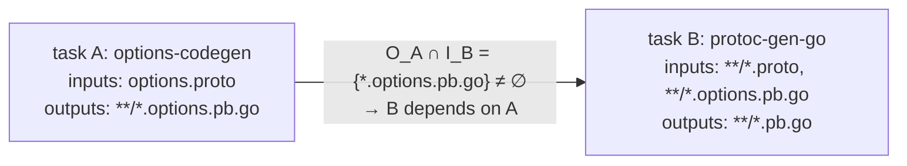

# lazygen Architecture

`lazygen` は monorepo 向けの **共有可能なキャッシュ機構を持つコード生成オーケストレーター** である。 既製のビルドツール ( Turborepo / Bazel / moonrepo / Pants) では実現できなかった「キャッシュ健全性の 2 防御線 ( OS 中立な logical version の取得元が runtime と必ず整合する仕組み / output-comparison)」を設計レベルで強制することを設計目標とする。

関連:
- [ADR-0001: キャッシュ可能コード生成オーケストレーターの選定](../adr/0001-cache-aware-codegen-orchestrator-decision.md) (= 自作)
- [ADR-0002: キャッシュヒット判定モデル](../adr/0002-cache-hit-decision-model.md) (= output-comparison)
- [ADR-0003: キャッシュレコードのストレージ方式](../adr/0003-record-storage-strategy.md) (= git per-task per-input ファイル)
- 各 Resolver の詳細設計:
  - [Resolver: script](./resolver-script.md) — prebuilt binary ( aqua 配布物 / go.mod tool / その他 `--version` を備えるバイナリ)
  - [Resolver: pnpm-external](./resolver-pnpm-external.md) — pnpm 外部公開パッケージ ( npm registry 等、 lockfile-based)
  - [Resolver: go-local](./resolver-go-local.md) — Go 内製ソース ( repo local main package)
  - [Resolver: pnpm-local](./resolver-pnpm-local.md) — pnpm workspace 内 内製パッケージ
  - [Resolver: buf](./resolver-buf.md) — buf.gen.yaml 経由の複合 plugin 群

## Context

### 背景

中〜大規模の polyglot monorepo では、 コード生成 ( proto / SQL モデル / mock / GraphQL / 内製 protoc plugin / pnpm 系コードジェネレータ など 数十のツール) にかかる時間が開発生産性のボトルネックになりやすい。 さらに 多くのチームで開発者間 / CI 間でキャッシュを共有できない構造になっており、 ブランチ切替 / 新規 clone のたびに毎回フル再生成が走る。

この課題に対する 3 つの大きな意思決定が先行 ADR で確定している:

- **[ADR-0001](../adr/0001-cache-aware-codegen-orchestrator-decision.md)**: 既製品 ( Turborepo / Bazel / moonrepo / Pants) は「キャッシュ健全性 2 防御線」を満たさないため **自作する**
- **[ADR-0002](../adr/0002-cache-hit-decision-model.md)**: cache hit 判定は **output-comparison** ( input_hash 一致 + record の output_hash と現状ツリーの output_hash 一致)
- **[ADR-0003](../adr/0003-record-storage-strategy.md)**: record は **git per-task per-input ファイル** で管理 (`.lazygen/cache/<spec_relpath>/<task_id>/<input_hash>.yml`)

本 Design Doc はこれら 3 つの決定を所与として、 `lazygen` の **全体アーキテクチャ** をまとめる。 各 distribution channel に対応する Resolver の詳細は別 doc に分割している ( 本 doc 冒頭の関連リンク参照)。

### 前提 ( ADR から継承)

- generator output は git 管理されている前提を採る ( typical な monorepo の運用)
- ヒット判定は output-comparison 方式 ( record の output_hash と現状ツリーの output_hash を照合)
- record は git 管理の per-task per-input ファイル (`.lazygen/cache/<spec_relpath>/<task_id>/<input_hash>.yml`)
- 開発者の OS は `darwin/arm64` / `linux/amd64` / `linux/arm64` のいずれかが基本対象。 Windows は対象外

### Goal

1. `lazygen` を Go 製の単一バイナリとして実装し、 開発者間 / CI 間で共有可能なコード生成キャッシュを提供する
2. `darwin/arm64` で生成された cache record を `linux/amd64` の CI でもそのまま再利用できる ( OS 横断キャッシュ共有)
3. cache record が構造的にコンフリクトしない ( ブランチ独立に生成しても安全にマージできる)
4. OSS / 内製を問わず generator が更新されたら自動で invalidate される

### Non-Goals

- artifact (生成物本体) のキャッシュ / 配信 (output は git 管理されている前提)
- generator 自体の高速化 ( buf / xo / sqlc 等の処理時間短縮)
- Windows 対応
- watch モード ( 初版では非対応)
- record の `schema_version` 移行戦略 ( 初版は schema_version 1 固定、 将来 schema を変える必要が生じた段階で別途検討)
- 環境構築タスク ( パッケージマネージャの install 等) のオーケストレーション。 lazygen は「pure な代入関数 ( inputs → outputs) としての generator」だけを扱い、 副作用が大きい install タスクは利用者の Makefile / shell スクリプト側に委ねる

## 要件

| ID | 要件 | 説明 |
|---|---|---|
| R1 | 共有可能 | cache record は git の同一コミット内で完結する |
| R2 | deterministic | 2 開発者が独立に生成しても同一バイト列の record が出力される |
| R3 | OS 非依存 | `darwin-arm64` / `linux-amd64` / `linux-arm64` で同じ record を共有できる |
| R4 | invalidate 安全性 | generator 本体 (OSS バイナリ / 内製 Go CLI / pnpm package / pnpm workspace 内 内製 / buf BSR 依存) が変更されたら確実に invalidate される |
| R5 | コンフリクト無し | 別タスクを別ブランチで触ったときに record ファイルが衝突しない |
| R6 | GC 可能 | 累積する古い record を CI / ローカルから安全に掃除できる |

## Decision

### 高レベル方針

- 単一バイナリ `lazygen` ( Go 製) として実装
- spec ファイル形式は `lazygen.yml` ( spec dir 単位で 1 ファイル)
- record は `.lazygen/cache/<spec_relpath>/<task_id>/<input_hash>.yml` に git 管理で配置
- record は **input hash → output hash + output ファイル一覧** の mapping のみ ( artifact は含まない)
- cache hit 判定は **output-comparison** ( ADR-0002): record を input_hash で引き、 record の output_hash と現状ツリーの output_hash が一致したら skip
- ツール invalidate は **OS 非依存な論理 version 文字列** を入力源別に取得して実現:
  - **prebuilt binary** ( aqua 配布物 / `go tool <name>` 経由のもの 等): script resolver が `<bin> --version` を実行し、 必要なら regex で抽出した文字列をそのまま採用 ( 「runtime のバイナリが SSoT」)
  - **npm 系** ( pnpm workspace 配下の外部 package): pnpm-lock.yaml の resolved version。 lockfile が runtime と乖離していないことは preflight で別途検証
  - **内製ソース** ( 内製 Go CLI / pnpm workspace 内 内製 js/ts ツール): entry point からのソースファイル集合の hash
- 内製ツール ( 内製 Go CLI / pnpm workspace 内 内製 js/ts ツール) を扱う Resolver は、 内部で **ソースファイル列挙戦略 ( `SourceLister`)** を選択する ( 標準は glob、 Go なら `go/packages`、 ts なら esbuild。 Pants 流の dependency inference を取り込む)
- preflight ( lockfile と install 状態の照合) は **lockfile を SSoT とする channel ( pnpm-external) のみ** で動かす。 script resolver / 内製ソース resolver では runtime バイナリやソース自体が SSoT のため、 preflight は構造的に不要
- record の永続化レイヤ ( Storage) も interface を切り、 初版は `GitFileStorage` のみ実装するが、 将来 S3 / Hybrid 等への切替を実装追加だけで可能にしておく



### spec ファイル形式

```yaml
# <spec_dir>/lazygen.yml
commands:
  - name: protoc-gen-go
    cmd: buf generate --template buf.gen.yaml
    inputs: ["**/*.proto", "buf.gen.yaml"]
    outputs: ["**/*.pb.go", "**/*.connect.go"]
    tools:
      # script resolver: prebuilt binary に --version 等を問い合わせる
      - exec: ["buf", "--version"]
      - exec: ["protoc-gen-go", "--version"]
        extract: 'v[0-9]+\.[0-9]+\.[0-9]+'
      # 他に使える resolver: pnpm-external (lockfile-based), go-local / pnpm-local (source-hash), buf (composite)
    # 注: depends フィールドは持たない。 依存は inputs / outputs から完全自動導出される
```

文法ポイント:

- `inputs` / `outputs` の **明示分離が必須**
- `tools` フィールドで明示的にツール宣言可能。 prebuilt binary は script resolver ( `exec` + 任意の `extract` regex)、 npm / 内製ソースは専用 resolver に振り分ける ( 後述の dispatch table 参照)
- `depends` フィールドは **持たない**。 依存は inputs / outputs から完全自動導出 ( 後述)

### キャッシュレコード schema

#### ファイル配置規則

```
<repo_root>/
└── .lazygen/cache/
    └── <spec_relpath>/             # spec dir からの相対パス。"/" を "_" に置換
        └── <task_id>/              # spec.commands[*].name の slug
            └── <input_hash>.yml    # 1 ファイル = 1 record
```

例: `path/to/spec/lazygen.yml` の `protoc-gen-go` タスクの場合

```
.lazygen/cache/path_to_spec/protoc-gen-go/3f9a1c....yml
```

#### YAML schema

```yaml
# .lazygen/cache/<spec_relpath>/<task_id>/<input_hash>.yml
schema_version: 1
spec:
  dir: path/to/spec
  task_id: protoc-gen-go
  cmd: "buf generate --template buf.gen.yaml"
input:
  hash: 3f9a1c...                       # ファイル名と一致 (self-describing)
  components:
    files_hash: a1b2...                 # inputs glob にマッチしたファイル群の SHA256
    cmd_hash: c3d4...                   # cmd 文字列の SHA256
    tools_hash: e5f6...                 # OS 横断 invalidate 戦略で詳述する論理 version の sorted concat の SHA256
output:
  hash: 7e2b...                         # outputs glob にマッチしたファイル群の SHA256
  files:                                # path → SHA256 (path 昇順)
    path/to/spec/foo.pb.go: 11aa...
    path/to/spec/bar.pb.go: 22bb...
generator_version_snapshot:             # 情報用。hash 計算には含めない
  - name: buf
    version: 1.30.0
    source: aqua.yaml
  - name: protoc-gen-go
    version: v1.34.2
    source: go.mod
generated_at: 2026-05-05T12:34:56Z      # 情報用。hash 計算には含めない
```

#### Deterministic ordering 規約 ( R2)

- YAML key は alphabetical 固定順 ( `gopkg.in/yaml.v3` のデフォルト挙動を override)
- `output.files` および `generator_version_snapshot` は path / name 昇順
- `generated_at` / `generator_version_snapshot` は人間可読性のためだけに保持し、 hash 計算には絶対に含めない
- ファイル末尾は LF 1 個で終端

#### Cache lookup アルゴリズム

```go
func runTask(spec CmdSpec) error {
    inputHash := computeInputHash(spec)
    recordPath := recordPath(spec, inputHash) // .lazygen/cache/<dir>/<task>/<hash>.yml
    if record, ok := loadRecord(recordPath); ok {
        currentOutputHash, err := hashOutputsOnDisk(record.Output.Files)
        if err == nil && currentOutputHash == record.Output.Hash {
            return nil // cache hit (ADR-0002: output-comparison)
        }
    }
    if err := runGenerator(spec); err != nil {
        return err
    }
    return writeRecord(spec, inputHash)
}

func computeInputHash(spec CmdSpec) string {
    return sha256Concat(
        hashFiles(globMatches(spec.Inputs)),         // files_hash
        sha256(strings.Join(spec.Cmd, " ")),         // cmd_hash
        toolsHash(spec),                             // tools_hash
    )
}
```

`hashOutputsOnDisk` は record に記載された output paths を走査し、 欠損 / 改変があれば mismatch を返す。 これが ADR-0002 で採用した output-comparison 方式の実装。

#### Storage interface ( 拡張性)

[ADR-0003](../adr/0003-record-storage-strategy.md) で採用した「git per-task per-input ファイル方式」は、 record を永続化する **複数の実装可能な戦略のうちの 1 つ**。 将来の規模変化や運用要求の変化 ( 例: record 容量が想定を超える、 artifact 共有が必要になる、 リモート組織と cache を共有したい等) に応じて、 record の置き場を S3 や Hybrid に切り替えられる余地を初版から残しておく。

そのため record の永続化レイヤは **Go interface を切り、 backend を plug-in 可能にする**。 これは resolver / preflight checker の拡張性設計と同じ思想。

```go
// internal/lazygen/cache/storage.go
package cache

import "context"

// Storage は record の永続化バックエンド ( git ファイル / S3 / Hybrid 等)
type Storage interface {
    // Name は backend 識別子 (例: "git-file", "s3", "hybrid")
    Name() string

    // Load は key に対応する record を取得する。 見つからなければ (nil, false, nil)
    Load(ctx context.Context, key Key) (*Record, bool, error)

    // Save は record を永続化する ( deterministic YAML エンコード)
    Save(ctx context.Context, key Key, record *Record) error

    // Delete は record を削除する ( GC で使用)
    Delete(ctx context.Context, key Key) error

    // List は GC / 集計用に key 一覧を列挙する
    List(ctx context.Context, filter ListFilter) ([]Key, error)
}

type Key struct {
    SpecRelpath string  // 例: "path/to/spec"
    TaskID      string  // 例: "protoc-gen-go"
    InputHash   string  // 例: "3f9a1c..."
}

type ListFilter struct {
    SpecRelpath string  // 空なら全 spec
    TaskID      string  // 空なら全 task
    OlderThan   time.Time  // 指定時刻より古い record のみ
}
```

組み込み実装 ( 初版):

- **`GitFileStorage`** ( ADR-0003 で採用): `.lazygen/cache/<spec_relpath>/<task_id>/<input_hash>.yml` に YAML として書き出し、 git 管理する

将来追加候補 ( 必要が生じた段階で対応):

- **`S3Storage`**: S3 / R2 等の object storage に PUT / GET ( ADR-0003 Option C 相当)
- **`HybridStorage`**: 小さな record は git に、 大きな record や artifact は S3 に振り分ける ( ADR-0003 Option E 相当)
- **`MemoryStorage`**: テスト用 ( in-memory map)

backend 選択は環境変数で切り替える想定:

```sh
# 既定 ( 初版実装ではこれのみ)
LAZYGEN_CACHE_BACKEND=git-file lazygen run --pattern '**/lazygen.yml'

# 将来 S3 を導入した場合
LAZYGEN_CACHE_BACKEND=s3 LAZYGEN_S3_BUCKET=lazygen-cache-prod lazygen run ...
```

##### 設計上の責務分離

- **Record** = 「何を保存するか」 ( YAML schema、 deterministic ordering)
- **Storage** = 「どこに / どうやって保存するか」 ( ファイル / object / DB)
- **output-comparison ロジック** ( cache lookup) は Storage backend に依存しない

これにより、 backend 切替 ( 例: GitFileStorage → S3Storage) を行っても、 cache 判定ロジック自体は再実装不要。 backend 追加 = `Storage` interface を 1 つ実装 + Registry に登録するだけで完結する。

##### 初版スコープ

初版は **`GitFileStorage` のみ実装** する ( ADR-0003 採用案)。 interface と Registry は最初から切るが、 他 backend は YAGNI 原則で実装しない。 将来 S3 / Hybrid が必要になった段階で interface に従って実装を追加する。

### OS 横断 invalidate 戦略

#### 棄却: 実行ファイル hash

直感的には `cmd[0]` のバイナリ本体を SHA256 して hash 入力に混ぜれば良さそうだが、 OS 横断キャッシュ共有を破壊する:

- aqua 配布バイナリは `darwin-arm64` / `linux-amd64` / `linux-arm64` でファイル本体が異なる
- `go tool` ディレクティブで build される Go ツールも `GOOS` / `GOARCH` 別バイナリ
- pnpm の binary cache (`~/.pnpm-store`) も同様

開発者 A (Mac) が生成した cache を 開発者 B / CI (Linux) が共有できない。 R3 を満たさないため棄却する。

#### 採用: 論理 version 文字列を resolver で取得

ツール identifier から、 distribution channel 別の resolver で **OS 非依存な論理 version 文字列** を取得する。 複数ツールを使う cmd では各 version を sorted concat → SHA256 して `tools_hash` とする。

各 channel の resolver は独立 doc にまとめている ( 本 doc 冒頭の関連リンク参照)。 概要だけ表で示す:

「version 文字列をどこから取るか」で 3 つに分類できる:

- **prebuilt binary**: 「実 install されているバイナリの `--version` 出力」が SSoT。 lockfile / install 状態のズレが構造的に起きないので preflight 不要 ( script resolver)
- **npm package**: lockfile を SSoT に取り、 lockfile vs install 状態は preflight で検証 ( pnpm-external resolver + checker)
- **内製ソース**: SemVer を持たないため、 ソースファイル集合の hash を logical version とする ( go-local / pnpm-local resolver)

| Channel | Resolver Name | 取得元 | preflight | 詳細 doc |
|---|---|---|---|---|
| prebuilt binary ( aqua / `go tool` 経由 / その他 `--version` 持ちバイナリ) | `script` | spec で宣言された `exec` の stdout (任意で `extract` regex) | 不要 | [resolver-script.md](./resolver-script.md) |
| Go 内製 ソース ( repo local main package) | `go-local` | `go/packages` 経由の transitive 依存 ( 内部 / 外部分離戦略) | 不要 | [resolver-go-local.md](./resolver-go-local.md) |
| pnpm 外部公開パッケージ | `pnpm-external` | `pnpm-lock.yaml` の resolved version | 必要 ( node_modules 整合) | [resolver-pnpm-external.md](./resolver-pnpm-external.md) |
| pnpm 内製 ソース ( workspace 内 local package) | `pnpm-local` | workspace package の src/ ソース hash ( esbuild API 経由) | build 必須なら dist 整合 | [resolver-pnpm-local.md](./resolver-pnpm-local.md) |
| `buf generate` 経由 | `buf` | `buf` 本体 ( script resolver) + `buf.gen.yaml` の plugin 群 ( 各 plugin type 別解決) | composite ( 各 plugin の preflight に再帰) | [resolver-buf.md](./resolver-buf.md) |
| その他 (シェル等) | — | 専用 resolver なし。 spec で `inputs` に当該スクリプトを含める運用 | — | — |



#### Dispatch: 明示宣言を基本に少数の名前付き dispatch

- spec の `tools: [...]` で明示宣言があればそれを優先
- 一部の channel ( `bufResolver` / `pnpmLocalResolver` 等) は `cmd[0]` の base name や cmd 形状から auto-dispatch する。 prebuilt binary 全般を覆う script resolver は **明示宣言された場合のみ動く** ( 「とりあえず `cmd[0] --version` を呼ぶ」推定は、 build timestamp や OS-arch を含む `--version` 出力で OS 横断キャッシュを壊しうるため avoid)
- `buf generate` のような複合 cmd は名前付き専用 resolver (`bufResolver`) が `buf.gen.yaml` を読んで plugin 一覧を返す
- どの resolver にも該当しない場合は警告ログを出し、 cmd 文字列のみを `tools_hash` 入力にフォールバック (= ツール変更には反応しないが、 cmd 変更には最低限反応)。 重要な generator では必ず `tools` 宣言を書く運用とする

具体的な Resolver / Registry の interface 定義は [resolver / preflight の拡張性](#resolver--preflight-の拡張性-interface-設計) 節にまとめる。

#### `SourceLister` 共通の挙動 / 利点

内製ツール ( SemVer を持たないリポジトリ内ソース) を扱う Resolver は内部で `SourceLister` を選択するが、 これは **Resolver 内部の実装詳細** であって lazygen のトップレベル拡張ポイントには数えない。 詳細は各 Resolver doc ([go-local](./resolver-go-local.md), [pnpm-local](./resolver-pnpm-local.md)) を参照。

`SourceLister` は実装にかかわらず ( `globLister` / `goPackagesLister` / `esbuildLister` のいずれでも) 以下を共通とする:

- **OS 非依存** ( build 成果物ではなくソーステキストの hash)
- **lazygen バイナリ単体で完結** ( go API 直接 import、 外部 CLI ツールへの依存ゼロ、 subprocess spawn なし)
- ソース変更には敏感に反応する
- **lazygen 1 run 内のメモ化**: 同一 entry ( 例: 同じ内製 protoc-gen-foo を多数の proto task が使う) を複数 task が参照する場合、 `SourceLister.List(ctx, entry)` の結果を `entry` をキーに run 内でキャッシュして 1 回だけ評価する。 これは Resolver / SourceLister の単純な最適化で、 cache 健全性に影響しない ( 同一入力に対する純粋関数の結果メモ化)
- **Resolver 単位で `SourceLister` を切替可能**: 標準実装で対応できないケース ( esbuild が静的解析できない eval / 動的 require を使う内製ツール、 `go/packages` で正しく取れない構造の Go プロジェクト等) では、 該当 Resolver の `SourceLister` を `globLister` に切り替える。 「精度は下がるが死角ゼロ」を選ぶ retreat path として常に提供する。 切替単位は Resolver なので、 影響範囲が局所化される

##### 性能上の優位性は別途 benchmark で検証が必要

import 解析ベースの hash 抽出は、 ファイル glob ベースの愚直な SHA256 計算と比べて **理論上は精度で優位** ( 不要ファイル除外で false miss 削減) だが、 **絶対的な実行時間としては愚直 glob の方が速い可能性が十分ある**:

- import 解析: per-task で 100 ms 〜 数百 ms ( `packages.Load` / `api.Build` の処理時間)
- 愚直 glob ( ディレクトリ配下を find して各ファイル SHA256): 10 ms 〜 数十 ms オーダー

つまり「invalidate 削減効果が hash 計算オーバーヘッドを上回るか」は **実装後に実測で確かめる必要** がある。 検証すべき指標:

- per-task の hash 計算時間 ( import 解析 vs 愚直 glob)
- invalidate 削減効果 ( 不要ファイル除外による false miss 削減 / cache hit 率向上)
- 全体としてのビルド時間トレードオフ ( hash 計算オーバーヘッド × task 数 vs 不要再生成回避時間)

検証結果次第で、 内製ツールのソース hash 抽出を **愚直 glob に retreat する** 選択肢もありうる ( Resolver の構造はそのまま、 内部の `SourceLister` を `goPackagesLister` / `esbuildLister` から `globLister` に差し替えるだけで対応可能)。 性能評価は Open Question として記録する ( 後述)。

#### Lockfile と install 状態の整合性検証 (preflight)

preflight が必要なのは、 `tools_hash` の取得元が lockfile であって runtime の実体と乖離する余地がある channel に限られる。 具体的には:

- **必要**: `pnpm-external` ( pnpm-lock.yaml と node_modules の整合)、 `pnpm-local` ( workspace package の build 出力 dist が src より新しいかの整合)、 `buf` ( buf.yaml deps と buf.lock の整合 / `buf.gen.yaml` の remote plugin pinned tag 強制)
- **不要**: `script` resolver ( runtime バイナリの `--version` を直接取得するため、 lockfile vs install の概念がそもそも存在しない)、 `go-local` ( ソース hash を直接取るため)

各 channel の検証内容は対応する Resolver doc を参照 ( [pnpm-external](./resolver-pnpm-external.md#preflight-checker) / [pnpm-local](./resolver-pnpm-local.md#preflight-checker) / [buf](./resolver-buf.md#preflight-checker))。

不整合検出時の挙動 ( preflight が走った channel 共通):

- **デフォルト**: lazygen を即時 fail させ、 必要な install コマンドを stderr に表示する。 record は **書き込まない**
- **CI**: 常に fail (override 不可)。 CI pipeline の前段で必ず install が走る前提と整合
- **ローカル escape hatch**: `LAZYGEN_ALLOW_STALE_DEPS=1` で警告に降格できる。 ただしこの mode で lazygen を走らせた場合、 cache record は書き込まず **read-only** で動かす ( 汚染 record の発生を構造的に防ぐ)

代替案として「install 結果ファイル本体 (`node_modules/.modules.yaml` 等) を `tools_hash` の構成要素にする」ことも検討したが、 (a) global install path が CI / 開発者で異なる、 (b) Go tool は `$GOMODCACHE` の存在チェックしか取れない、 といった理由で SSoT にはせず、 preflight の比較対象として補助的に使うに留める。

### resolver / preflight の拡張性 (interface 設計)

新しいツールチェーン (例: `mise`、 `asdf`、 `nix`、 `bun`、 `deno`、 `cargo` 等) や独自の依存プロバイダが将来導入された場合に、 lazygen 本体の改修を最小化したい。 そのため tool version resolver と preflight checker は **それぞれ Go interface を切り、 registry に登録する plugin パターン** で実装する。

#### Resolver interface

```go
// internal/lazygen/toolresolver/resolver.go
package toolresolver

import "context"

// Resolver は単一の distribution channel ( script / pnpm-external / go-local / pnpm-local / buf 等) を担当する
type Resolver interface {
    // Name は resolver 識別子。 spec の `tools: - <name>: <key>` で参照される
    Name() string

    // CanResolve は与えられた cmd を本 resolver が解決できるかを判定する (auto-dispatch 用)
    CanResolve(specDir string, cmd []string) bool

    // Resolve は cmd / declared tool key から OS 非依存な ToolVersion を返す
    Resolve(ctx context.Context, specDir string, cmd []string, declaredKey string) ([]ToolVersion, error)
}

type ToolVersion struct {
    Name    string // 表示用 (例: "buf")
    Version string // 論理 version 文字列 (例: "v1.30.0", "sha256:abcd...")
    Source  string // 取得元 (例: "aqua.yaml", "go.mod", "pnpm-local:@org/my-codegen")
}
```

組み込み実装: `scriptResolver` ( prebuilt binary 全般)、 `goLocalResolver` (内製 Go CLI), `pnpmExternalResolver`, `pnpmLocalResolver` (pnpm workspace 内 内製), `bufResolver` (`buf.gen.yaml` 解析の特殊形 / 内部で script に再帰)。 各 Resolver の実装詳細は対応する独立 doc を参照。

Registry:

```go
// internal/lazygen/toolresolver/registry.go
type Registry struct {
    byName    map[string]Resolver  // 明示宣言の dispatch
    inDispatchOrder []Resolver     // auto-dispatch の試行順
}

func (r *Registry) Register(rs Resolver) { /* ... */ }

func (r *Registry) Resolve(ctx context.Context, specDir string, cmd []string, declared []DeclaredTool) ([]ToolVersion, error) {
    // 1. declared ありなら、 各 entry の resolver name で byName lookup
    // 2. なければ inDispatchOrder で CanResolve(true) になる最初の resolver
    // 3. どれも該当しなければ警告ログ + cmd 文字列 fallback
}
```

新 channel ( 例: 既存と異なる lockfile-based エコシステム) を追加するときは、 対応 `Resolver` を実装し `Registry.Register` で登録するだけで済む。 prebuilt binary 系の追加対応は基本 `scriptResolver` で吸収できるため、 新 Resolver の追加は本質的に新しい lockfile / 新しい source-hash 戦略を必要とするケースに限られる。

#### Preflight interface

```go
// internal/lazygen/preflight/preflight.go
package preflight

import "context"

// Checker は単一の依存プロバイダ ( pnpm-external / pnpm-local / buf BSR 等 lockfile-based channel) の install 状態を検証する
type Checker interface {
    Name() string                                     // resolver と同じ Name で対応付け
    Check(ctx context.Context, specDir string) (Result, error)
}

type Result struct {
    OK     bool
    Issues []Issue
}

type Issue struct {
    Channel    string  // どの channel の不整合か
    Detail     string  // 何がズレているか
    Suggestion string  // 是正コマンド
}
```

組み込み実装: `pnpmExternalChecker`, `pnpmLocalChecker`, `bufChecker`。 lockfile / build 状態を SSoT として持つ channel のみが Checker を持つ。 `scriptResolver` / `goLocalResolver` には対応 Checker は存在しない ( 構造的に不要)。

Registry の動作:

- lazygen の起動時に、 ある spec で使われる resolver の Name 一覧を集約し、 そのうち Checker を持つ channel についてだけ all-or-nothing で実行
- いずれかが Issue を返したら lazygen は fail (前述の preflight ポリシーに従う)

#### 拡張ポイントの責務分離

2 つの interface はそれぞれ別の責務を持ち、 互いに直交する:

- **Resolver** = 「**version 文字列を返す**」純粋関数 ( hash 入力構成のため)
- **Preflight Checker** = 「**lockfile と install 状態の整合性を判定する**」副作用なし read-only 検証

別々の interface に分けることで、 例えば「 hash 計算には version 文字列が取れるが、 preflight は別の検証経路が必要」という channel ( 例: `nix flake.lock` のような cas-based なもの) も柔軟に組み込める。

##### Resolver 内部の `SourceLister` ( 言及)

内製ツール ( SemVer を持たないリポジトリ内ソース) を扱う Resolver は、 内部で「ソースファイル列挙戦略」を選ぶ ( 標準 `globLister`、 言語別 `goPackagesLister` / `esbuildLister` 等)。 これは **Resolver 内部の実装詳細** であり、 トップレベルの拡張ポイントには数えない。 詳細は [resolver-go-local.md](./resolver-go-local.md) / [resolver-pnpm-local.md](./resolver-pnpm-local.md) を参照。

新しい言語 ( Python / Rust 等) の内製ツールに対応する場合、 該当する Resolver 実装の中で `SourceLister` を新規実装するか、 既存 `globLister` で済ませるかを選ぶ。 `SourceLister` は Resolver 単位で完結するため、 lazygen 全体の拡張ポイントを増やさない。

#### Future channel candidates ( 拡張想定)

prebuilt binary 系 ( `mise` / `asdf` 等で配布される CLI、 自前 download スクリプトで取り回す binary 等) は **基本 `scriptResolver` で吸収できる** ため、 個別 Resolver を追加する必要は無い。 ユーザーは `tools: [{exec: ["<bin>", "--version"], extract: "..."}]` を書くだけ。

専用 Resolver / Preflight Checker の追加が必要になるのは、 lockfile-based または ソース hash 戦略を新規に必要とするケース:

| 想定 channel | 取得元 | Preflight の検証内容 | 内製ツール対応時の `SourceLister` |
|---|---|---|---|
| `nix` | `flake.lock` | `nix flake check` | — |
| `bun` | `bun.lockb` | `node_modules/` 整合性 (pnpm と類似) | `esbuildLister` ( 既存) を流用 |
| `deno` | `deno.lock` | `deno cache --reload` の成功 | TypeScript Compiler API based の代替 lister を検討 |
| `cargo` | `Cargo.lock` | `cargo metadata` | `cargo metadata --format-version 1` 経由の rust 用 lister を検討 |
| Python ( 仮) | `*.lock` ( poetry / uv) | install 状態確認 | ast module ベースの python 用 lister を検討 |

これらは現時点では実装しないが、 必要が生じた段階で対応する **Resolver / Preflight Checker** を 1 対追加するだけで対応可能 ( lazygen 本体に変更不要)。 Resolver 内部の `SourceLister` は Resolver 実装側で必要なら新規追加する ( トップレベルの拡張ポイントは増やさない)。

### タスク間依存 (inputs / outputs からの自動導出)

依存関係は **`inputs` と `outputs` から完全に自動導出する**。 lazygen には `depends` のような手動依存宣言フィールドは **存在しない**。

これは単に DRY のためではなく、 **キャッシュ機構の健全性を担保するための必然** である。 詳細は本節末尾の [なぜ手動 `depends` を持たないか](#なぜ手動-depends-を持たないか-キャッシュ健全性の前提) を参照。

#### 自動導出アルゴリズム

1. 全 spec を読み込み、 各 task の `inputs` / `outputs` glob を expand して実ファイル集合を得る ( I_t, O_t)
2. 任意の 2 task A, B について、 `O_A ∩ I_B ≠ ∅` ( = A の出力ファイルのいずれかが B の入力に含まれる) なら、 B → A の依存を自動で貼る
3. 構築された DAG で実行順を決定



example:

- task `proto/options/options-codegen`
  - `inputs: ["options.proto"]`
  - `outputs: ["**/*.options.pb.go"]`
- task `path/to/spec/protoc-gen-go`
  - `inputs: ["**/*.proto", "**/*.options.pb.go", "buf.gen.yaml"]`
  - `outputs: ["**/*.pb.go", "**/*.connect.go"]`

→ `protoc-gen-go` の `inputs` glob に `*.options.pb.go` が含まれており、 これは `options-codegen` の `outputs` の実ファイルにマッチする。 lazygen は自動的に **`protoc-gen-go → options-codegen` の依存** を構築する。

#### なぜ手動 `depends` を持たないか (キャッシュ健全性の前提)

lazygen のキャッシュが信頼できる前提は、 **「generator は spec で宣言された `inputs` 以外を読まず、 宣言された `outputs` 以外を書かない」** こと。 この前提が成立するなら、 上流 task の output が変わったときに下流 task の `input_hash` が必ず変わる ( 上流 output が下流 inputs に含まれるため)。

仮に「inputs にも outputs にも現れない論理依存」があるとすると:

1. 上流 task の output が変わっても、 下流 task の `input_hash` には反映されない
2. 下流は `input_hash` 一致 → cache hit → skip
3. **古い結果のまま動く** ( cache が嘘をつく)

つまり「手動 `depends` で表現したくなる依存」が存在する状況 = **「inputs / outputs の宣言が現実の generator 挙動を反映していない」状況** = **cache 機構自体が信頼できない状況**。 手動 `depends` を導入してその場の DAG を救済しても、 hash ベースの cache 判定が嘘をついている根本問題は解消されない ( むしろ「依存は明示してあるからキャッシュも信頼できる」という偽の安心感を生む)。

したがって lazygen では:

- **手動 `depends` フィールドは設けない**
- 依存表現はすべて inputs / outputs からの自動導出で行う
- もし「自動導出で見つからない依存」が必要に見えたら、 それは spec の `inputs` / `outputs` 宣言が不完全である合図。 spec を修正するのが正しい対応
- 上記の前提を満たせない generator (`inputs` 外を読む / `outputs` 外を書く / 副作用が大きい / non-deterministic) は **そもそも lazygen のスコープ外**。 利用者の Makefile / shell スクリプト側に残すか、 generator 自体を修正する

この立場は不便なように見えるが、 「キャッシュは健全な generator にのみ意味がある」という根本原則を spec / 実装レベルで強制する設計判断。

#### invalidate チェーン

invalidate チェーンの実装は、 **「上流 task の最新 output hash を、 下流 task の `tools_hash` 隣に sorted concat で混ぜる」** ことで自然に成立する。 上流のいずれかの output が変われば下流の `input.hash` も変わり、 別の record ファイルを引くため、 明示的な force フラグなどは不要 ( record の不一致で自動的に miss する)。

#### 実装上の留意点

- 全 task の glob expand は **lazygen 1 run 内で 1 回だけ** 行い、 task 間で結果を共有する ( I_t / O_t の集合をメモ化)
- 交差判定は task 数 N に対して O(N²) だが、 実用上の monorepo 規模 ( 200 task 程度) では現実的なオーダー
- chicken-and-egg ( 完全初回で output ファイルが存在しない) は generator 出力が git 管理されている前提のため通常起きない。 fresh clone 直後でも前回の generator output は git tree に存在する。 完全な初期化は cache miss で全 task 実行
- `lazygen graph` サブコマンドで導出された DAG を Mermaid / DOT で可視化し、 「なぜ A → B の依存があるのか」をデバッグできるようにする (auto-detect の根拠ファイルも併記)
- `lazygen run --explain <task>` で個別 task の cache hit / miss 理由 ( 上流のどの output が変わって invalidate されたか) を表示

#### 暗黙性の懸念と緩和策

自動導出は spec から「なぜこの順序か」が読み取りにくくなる暗黙性のトレードオフがある。 緩和策:

- `lazygen graph` で可視化
- `lazygen run --explain` で個別判定の根拠表示
- `inputs` / `outputs` の宣言粒度を細かく保つ文化 (`outputs: ["**/*"]` のような雑な宣言を spec lint で警告)
- PR レビュー時、 spec の `inputs` / `outputs` 変更が依存関係を変える可能性があることを意識する運用ルール

### ゴミ (古い record) の扱い

per-task per-input ファイル方式では record が累積する。 容量見積りは保守的に試算しても、 `1 record ≒ 2KB × タスク数 200 × 並走世代 10 ≒ 4MB` 程度に収まる見込み。 ただし長期運用では掃除機構が必要。 4 段で提供する:

- **CI nightly sweep**: GitHub Actions の scheduled job で、 git mtime が直近 90 日以内に触れられていない record を列挙し、 削除 PR を bot 投稿する
- **`lazygen cache gc` サブコマンド**: 同一 task 配下の record 数が閾値 ( デフォルト 50) を超えたら mtime 古い順に削除。 手元で生成後に実行できる
- **task rename / 削除コミットでの自動削除**: lefthook / pre-commit hook に「 spec を変更/削除する diff があれば、 対応する `.lazygen/cache/<spec_dir>/<task_id>/` も削除する」step を追加
- **長期的オプション ( 本 Doc スコープ外)**: record 容量が想定を超えたら git LFS 化、 または Hybrid ( ADR-0003 Option E) への拡張余地は残す

### PR ノイズ抑制

`.lazygen/cache/**` を `.gitattributes` で `linguist-generated=true` 指定し、 GitHub PR diff の default collapsed 化。 PR template に「`.lazygen/cache/` 配下の差分は人間レビュー対象外」と明記する運用ルールを併設する。

## Open Questions

- **Q1**: 同 input hash で複数 OS が独立に走った時、 output hash が真に一致するか。 一致しない generator (例: 行末コード差、 絶対パス埋込、 time.Now embed) が出た場合の対処方針。 cross-OS double-run 検証 CI を入れて早期発見するか
- **Q2**: 開発者が手元で `.lazygen/cache/` を `.gitignore` に足したくなる誘惑をどう抑制するか。 CI で record の commit を強制する pre-push hook、 または PR 上で record 差分が無い場合は warning 表示する仕組み
- **Q3**: ファイル粒度の import 解析を **inputs / outputs 自動導出にも適用するか** ( Pants 流のファイル粒度依存導出への発展)。 現状 lazygen は task 粒度では glob ベースで自動導出するが、 inputs glob 配下の "実際に他 task の outputs を import しているファイル" だけを抽出して精度を上げる余地はある。 ただし「import 解析が間違うと cache が嘘をつく」リスクとのトレードオフ。 初版は glob ベースで十分とし、 運用知見が溜まった段階で再検討
- **Q4** ( benchmark 検証): import 解析ベースの hash 抽出 ( `goPackagesLister` / `esbuildLister`) が、 愚直 glob ベース ( `globLister`) と比べて **総合的なビルド時間で優位か**。 import 解析は精度で勝るが per-task で 100 ms 〜 数百 ms かかる。 愚直 glob は 10 ms 〜 数十 ms。 invalidate 削減効果が hash 計算オーバーヘッドを上回るかを実装後に benchmark で検証する。 検証結果次第で `globLister` への retreat も選択肢 ( Resolver 内部 helper の差し替えのみで対応可能)

各 Resolver 固有の Open Questions は対応する Resolver doc を参照。

## File Layout

```
.lazygen/cache/                             # ★ cache record root (利用者リポジトリ側に作成)
  <spec_relpath>/<task_id>/<input_hash>.yml

# lazygen 自身のコードベース ( github.com/izumin5210/lazygen):
cmd/lazygen/main.go                         # CLI エントリ (`lazygen run` / `lazygen cache gc` 等)
internal/lazygen/
  spec.go                                   # lazygen.yml パース、 CmdSpec
  runner.go                                 # 並列 runner、 cache lookup / write
  hash.go                                   # input/output hash 計算
  depgraph.go                               # inputs / outputs からの依存自動導出 + DAG 構築
  explain.go                                # `lazygen run --explain` / `lazygen graph` の判定根拠出力
  cache/                                    # ★ Storage interface + Registry
    record.go                               # Record 型 (YAML schema, deterministic marshal/unmarshal)
    storage.go                              # Storage interface, Key / ListFilter 型
    registry.go                             # Storage registry (LAZYGEN_CACHE_BACKEND による backend 選択)
    gitfile/                                # ★ 各 backend は独立 Go package
      gitfile.go                            # GitFileStorage (採用、 ADR-0003)
    # 将来追加候補 ( 初版では実装しない、 各々独立 package で実装):
    #   s3/s3.go             (S3Storage,     ADR-0003 Option C)
    #   hybrid/hybrid.go     (HybridStorage, ADR-0003 Option E)
    #   memory/memory.go     (MemoryStorage, テスト用)
  toolresolver/                             # ★ Resolver interface + Registry
    resolver.go                             # Resolver interface, ToolVersion 型
    registry.go                             # Registry (byName + dispatch order)
    script/                                 # ★ 各 Resolver は独立 Go package
      script.go                             # package script (prebuilt binary 全般、 詳細は resolver-script.md)
    buf/
      buf.go                                # package buf (詳細は resolver-buf.md)
    golocal/
      golocal.go                            # package golocal / internal: goPackagesLister (詳細は resolver-go-local.md)
    pnpmexternal/
      pnpmexternal.go                       # package pnpmexternal (詳細は resolver-pnpm-external.md)
    pnpmlocal/
      pnpmlocal.go                          # package pnpmlocal / internal: esbuildLister (詳細は resolver-pnpm-local.md)
    lister/                                 # Resolver 内部 helper (トップレベル拡張点ではない、 1 package で十分)
      lister.go                             # SourceLister interface
      glob.go                               # globLister (標準実装、 ディレクトリ配下を glob 列挙)
      gopackages.go                         # goPackagesLister (golang.org/x/tools/go/packages を直接 import)
      esbuild.go                            # esbuildLister (github.com/evanw/esbuild/pkg/api を直接 import)
      # 将来追加候補 ( 初版では実装しない):
      #   tsc.go             (TypeScript Compiler API ベースの代替)
      #   cargo_metadata.go  (Rust 用)
      #   python_ast.go      (Python ast module ベース)
  preflight/                                # ★ Checker interface + Registry (lockfile/build 状態を SSoT とする channel のみ実装)
    preflight.go                            # Checker interface, Result/Issue 型
    registry.go
    buf/
      buf.go                                # package buf
    pnpmexternal/
      pnpmexternal.go                       # package pnpmexternal
    pnpmlocal/
      pnpmlocal.go                          # package pnpmlocal ( pnpm workspace 内 内製の build 状態検証)
    # script resolver と go-local resolver には対応 Checker を置かない (構造的に不要、 [preflight 節](#lockfile-と-install-状態の整合性検証-preflight) 参照)

# 利用者リポジトリ側に作成するファイル ( lazygen 利用時)
<spec_dir>/lazygen.yml                      # task 定義
.lazygen/cache/                             # 自動生成される record 群
.gitattributes                              # .lazygen/cache/** に linguist-generated=true を指定推奨
```

#### Resolver / Preflight Checker / Storage backend の package 分割方針

各実装 ( scriptResolver / pnpmExternalResolver / pnpmExternalChecker / GitFileStorage 等) は **それぞれ独立した Go package** として配置する ( ファイル単位ではなくディレクトリ単位)。 理由:

- 各実装が独立した Go package となることで、 import 関係 ( 何を依存するか) が明示的に分離される
- 単独 package のテストが書ける ( scriptResolver のテストが pnpmExternalResolver の実装に巻き込まれない)
- 将来の channel 追加 ( nix / cargo 等の lockfile-based) も「新 package を 1 つ追加」で完結し、 既存 package を触らない
- internal ヘルパーの可視性も Go の package 境界で自然に閉じ込められる

トップレベル package ( `toolresolver` / `preflight` / `cache`) には interface 定義と Registry のみを置き、 各実装 package は interface を import して `Resolver` / `Checker` / `Storage` を返す factory を export する。 Registry には `main.go` 等の起動側で必要な実装を組み立てて register する ( DI コンテナ的な使い方)。

`SourceLister` ( Resolver 内部 helper) は **トップレベル拡張ポイントではないため 1 package** で十分とする ( `lister.go` / `glob.go` / `gopackages.go` / `esbuild.go` を同じ package に同居)。 ここを細かく分けすぎると過剰設計になる。
