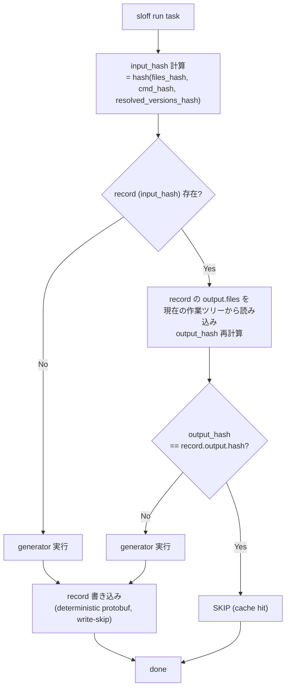
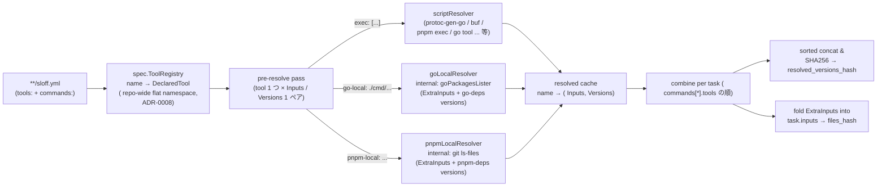
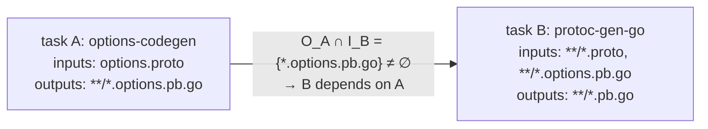

# sloff Architecture

`sloff` は monorepo 向けの **共有可能なキャッシュ機構を持つコード生成オーケストレーター** である。 既製のビルドツール ( Turborepo / Nx / Bazel / moonrepo / Pants) では実現できなかった「キャッシュ健全性の 2 防御線 ( OS 中立な logical version の取得元が runtime と必ず整合する仕組み / output-comparison)」を設計レベルで強制することを設計目標とする。

関連:
- [ADR-0001: キャッシュ可能コード生成オーケストレーターの選定](../adr/0001-cache-aware-codegen-orchestrator-decision.md) (= 自作)
- [ADR-0002: キャッシュヒット判定モデル](../adr/0002-cache-hit-decision-model.md) (= output-comparison)
- [ADR-0003: キャッシュレコードのストレージ方式](../adr/0003-record-storage-strategy.md) (= git per-task per-input ファイル)
- [ADR-0006: sloff は buf を special-case しない](../adr/0006-no-buf-specific-resolver-or-preflight.md) (= 汎用プリミティブで完結させる)
- [ADR-0007: sloff は外部依存専用 resolver を持たない](../adr/0007-no-external-dependency-resolver.md) (= 外部公開パッケージは script で吸収)
- [ADR-0008: tool を first-class spec entity とする](../adr/0008-tool-as-first-class-spec-entity.md) (= named tool + repo-wide flat namespace)
- 各 Resolver の詳細設計:
  - [Resolver: script](./resolver-script.md) — prebuilt binary ( nix / mise / aqua 等で配布されるもの / `go tool` 経由 / `pnpm exec` 経由 / 外部 OSS パッケージの `<bin> --version` も含む)
  - [Resolver: go-local](./resolver-go-local.md) — Go 内製ソース ( repo local main package)
  - [Resolver: pnpm-local](./resolver-pnpm-local.md) — pnpm workspace 内 内製パッケージ

## Context

### 背景

中〜大規模の polyglot monorepo では、 コード生成 ( proto / SQL モデル / mock / GraphQL / 内製 protoc plugin / pnpm 系コードジェネレータ など 数十のツール) にかかる時間が開発生産性のボトルネックになりやすい。 さらに 多くのチームで開発者間 / CI 間でキャッシュを共有できない構造になっており、 ブランチ切替 / 新規 clone のたびに毎回フル再生成が走る。

この課題に対する 3 つの大きな意思決定が先行 ADR で確定している:

- **[ADR-0001](../adr/0001-cache-aware-codegen-orchestrator-decision.md)**: 既製品 ( Turborepo / Nx / Bazel / moonrepo / Pants) は「キャッシュ健全性 2 防御線」を満たさないため **自作する**
- **[ADR-0002](../adr/0002-cache-hit-decision-model.md)**: cache hit 判定は **output-comparison** ( input_hash 一致 + record の output_hash と現状ツリーの output_hash 一致)
- **[ADR-0003](../adr/0003-record-storage-strategy.md)**: record は **git per-task per-input ファイル** で管理 (`.sloff/cache/<spec_relpath>/<task_id>/<input_hash>.pb`)

本 Design Doc はこれら 3 つの決定を所与として、 `sloff` の **全体アーキテクチャ** をまとめる。 各 distribution channel に対応する Resolver の詳細は別 doc に分割している ( 本 doc 冒頭の関連リンク参照)。

### 前提 ( ADR から継承)

- generator output は git 管理されている前提を採る ( typical な monorepo の運用)
- ヒット判定は output-comparison 方式 ( record の output_hash と現状ツリーの output_hash を照合)
- record は git 管理の per-task per-input ファイル (`.sloff/cache/<spec_relpath>/<task_id>/<input_hash>.pb`)
- 開発者の OS は `darwin/arm64` / `linux/amd64` / `linux/arm64` のいずれかが基本対象。 Windows は対象外

### Goal

1. `sloff` を Go 製の単一バイナリとして実装し、 開発者間 / CI 間で共有可能なコード生成キャッシュを提供する
2. `darwin/arm64` で生成された cache record を `linux/amd64` の CI でもそのまま再利用できる ( OS 横断キャッシュ共有)
3. cache record が構造的にコンフリクトしない ( ブランチ独立に生成しても安全にマージできる)
4. OSS / 内製を問わず generator が更新されたら自動で invalidate される

### Non-Goals

- artifact (生成物本体) のキャッシュ / 配信 (output は git 管理されている前提)
- generator 自体の高速化 ( generator 本体の処理時間短縮)
- Windows 対応
- watch モード ( 初版では非対応)
- record の `schema_version` 跨ぎの後方互換読み込み ( 異なる schema_version の record を同じバイナリで両対応する経路は実装しない、 ADR-0009)。 wire-incompatible な変更が発生した場合は proto package を `sloff.v2` に切り出す運用
- 環境構築タスク ( パッケージマネージャの install 等) のオーケストレーション。 sloff は「pure な代入関数 ( inputs → outputs) としての generator」だけを扱い、 副作用が大きい install タスクは利用者の Makefile / shell スクリプト側に委ねる

## 要件

| ID | 要件 | 説明 |
|---|---|---|
| R1 | 共有可能 | cache record は git の同一コミット内で完結する |
| R2 | deterministic | 2 開発者が独立に生成しても同一バイト列の record が出力される |
| R3 | OS 非依存 | `darwin-arm64` / `linux-amd64` / `linux-arm64` で同じ record を共有できる |
| R4 | invalidate 安全性 | generator 本体 (OSS バイナリ / 内製 Go CLI / pnpm package / pnpm workspace 内 内製 / buf BSR 依存) が変更されたら確実に invalidate される |
| R5 | コンフリクト無し | 別タスクを別ブランチで触ったときに record ファイルが衝突しない |
| R6 | GC 可能 | 累積する古い record を CI / ローカルから安全に掃除できる |

## Decision

### 高レベル方針

- 単一バイナリ `sloff` ( Go 製) として実装
- spec ファイル形式は `sloff.yml` ( spec dir 単位で 1 ファイル)
- record は `.sloff/cache/<spec_relpath>/<task_id>/<input_hash>.pb` に git 管理で配置 (protobuf binary、 ADR-0009)
- record は **input hash → output hash + output ファイル一覧** の mapping のみ ( artifact は含まない)
- cache hit 判定は **output-comparison** ( ADR-0002): record を input_hash で引き、 record の output_hash と現状ツリーの output_hash が一致したら skip
- ツール invalidate は **OS 非依存な論理 version 文字列** を入力源別に取得して実現:
  - **prebuilt binary** ( nix / mise / aqua 等で配布されるもの / `go tool <name>` 経由 / `pnpm exec` 経由 等): script resolver が `<bin> --version` を実行し、 必要なら regex で抽出した文字列をそのまま採用 ( 「runtime のバイナリが SSoT」)。 npm 配布物も `pnpm exec <bin> --version` 等で同経路に乗せる ([ADR-0007](../adr/0007-no-external-dependency-resolver.md))
  - **内製ソース** ( 内製 Go CLI / pnpm workspace 内 内製 js/ts ツール): entry point からのソースファイル集合の hash
- 内製ツール ( 内製 Go CLI / pnpm workspace 内 内製 js/ts ツール) を扱う Resolver は、 内部で **ソースファイル列挙戦略 ( `SourceLister`)** を選択する ( 標準は glob、 Go なら `go/packages`)。 Pants 流の dependency inference は Go 側で部分的に取り込む
- preflight ( cmd 実行前の state 検証) は **検証したい invariant が channel 別に存在するときに Checker を持つ** general subsystem。 現状の builtin は `pnpm-local` の install drift checker のみ ( `pnpm-lock.yaml` vs `node_modules/.pnpm/lock.yaml` の byte 一致確認)。 script resolver / go-local では runtime バイナリやソース自体が SSoT のため Checker 不要 ( [ADR-0007](../adr/0007-no-external-dependency-resolver.md) / [ADR-0008](../adr/0008-tool-as-first-class-spec-entity.md) D7)
- record の永続化レイヤ ( Storage) も interface を切り、 初版は `LocalStorage` のみ実装するが、 将来 S3 / Hybrid 等への切替を実装追加だけで可能にしておく



### spec ファイル形式

```yaml
# <spec_dir>/sloff.yml — tools と commands は同居 / どちらか片方だけでも可 ( ADR-0008)
tools:
  # tool 名 ( slug-style: [a-z0-9_-]+) → 1 つの resolver shape
  buf:
    exec: ["buf", "--version"]
  protoc-gen-go:
    exec: ["protoc-gen-go", "--version"]
    extract: 'v[0-9]+\.[0-9]+\.[0-9]+'
  # 他に使える tool 形式: go-local / pnpm-local (source-hash)
  # 外部公開パッケージは script で吸収する (ADR-0007)

commands:
  - name: protoc-gen-go
    cmd: buf generate --template buf.gen.yaml
    inputs: ["**/*.proto", "buf.gen.yaml", "buf.yaml", "buf.lock"]
    outputs: ["**/*.pb.go", "**/*.connect.go"]
    tools: [buf, protoc-gen-go]    # tool 名のリストで参照
    # 注: depends フィールドは持たない。 依存は inputs / outputs から完全自動導出される
    # buf を使う場合は buf.gen.yaml / buf.yaml / buf.lock を inputs に含める ( ADR-0006)。
    # buf 専用の resolver / preflight は持たず、 設定変更は files_hash 経路で invalidate される。
```

文法ポイント:

- `inputs` / `outputs` の **明示分離が必須**
- `tools` ブロックは **任意**。 同じ `sloff.yml` 内で `commands:` と共存可、 別 `sloff.yml` で定義された tool を参照することも可 ( namespace は repo-wide で flat、 ADR-0008)
- `commands[*].tools` は **tool 名の文字列リスト** ( inline 宣言は不可)。 prebuilt binary は script resolver、 内製ソースは専用 resolver に振り分ける ( 後述の dispatch table 参照)
- tool 定義の path 系フィールド ( `go-local: ./cmd/foo` 等) は **その tool が定義された `sloff.yml` の dir 相対** で解釈される ( 参照元 task の dir ではない、 ADR-0008 D3)
- `inputs` / `outputs` の glob pattern は **spec dir 相対**。 `..` を含む pattern も許容され、 monorepo 典型の cross-dir codegen ( e.g. `proto/<svc>/sloff.yml` から `../../gen/go/**/*.pb.go` を出力) を spec の置き場所と関心事のスコープを揃えたまま表現できる。 ただし正規化後に repoRoot を抜ける pattern ( e.g. `../../../etc/passwd`) は load 時 error として弾く ( spec が repo 外を hash しないことを構造的に担保)
- `depends` フィールドは **持たない**。 依存は inputs / outputs から完全自動導出 ( 後述)

### キャッシュレコード schema

#### ファイル配置規則

```
<repo_root>/
└── .sloff/cache/
    └── <spec_relpath>/             # spec dir からの相対パス ( ディレクトリ階層をそのまま展開)
        └── <task_id>/              # spec.commands[*].name の slug
            └── <input_hash>.pb     # 1 ファイル = 1 record (protobuf binary, ADR-0009)
```

例: `path/to/spec/sloff.yml` の `protoc-gen-go` タスクの場合

```
.sloff/cache/path/to/spec/protoc-gen-go/3f9a1c....pb
```

`spec_relpath` は階層を verbatim に保持する ( `"/"` を `"_"` 等に置換しない)。これにより `Storage.List` が record パスから `spec_relpath` をロスレスに復元でき、 spec dir 名にアンダースコアを含むケースでも識別が破綻しない。

#### Schema (protobuf)

record の wire schema は [`proto/sloff/v1/cache.proto`](../../proto/sloff/v1/cache.proto) が SSoT。 generated Go code は `internal/proto/sloff/v1/cache.pb.go` ( package `sloffv1`)。

論理構造を JSON 表記で示すと:

```json
// .sloff/cache/<spec_relpath>/<task_id>/<input_hash>.pb (decoded via `sloff cache show`)
{
  "schema_version": "SCHEMA_VERSION_V2",
  "spec": {
    "dir": "path/to/spec",
    "task_id": "protoc-gen-go",
    "cmd": "buf generate --template buf.gen.yaml"
  },
  "input": {
    "hash": "3f9a1c...",                  // ファイル名と一致 (self-describing)
    "files_hash": "a1b2...",              // inputs glob にマッチしたファイル群の SHA256
    "cmd_hash": "c3d4...",                // cmd 文字列の SHA256
    "resolved_versions_hash": "e5f6...",  // OS 横断 invalidate 戦略で詳述する論理 version の sorted concat の SHA256
    "resolved_versions": [                // hash 入力 + informational detail を 1 箇所に統合
      { "name": "buf",            "version": "script:buf@1.30.0",                  "source": "script:buf" },
      { "name": "protoc-gen-go",  "version": "go-deps:.../protobuf@v1.34.2+sum:...", "source": "go-local:./cmd/..." }
    ]
  },
  "output": {
    "hash": "7e2b...",
    "files": [
      { "path": "path/to/spec/bar.pb.go", "hash": "22bb..." },
      { "path": "path/to/spec/foo.pb.go", "hash": "11aa..." }
    ]
  },
  "generated_at": "2026-05-05T12:34:56Z"   // 情報用。hash 計算には含めない
}
```

#### Deterministic ordering 規約 ( R2)

- proto wire format は `proto.MarshalOptions{Deterministic: true}` で encode する (`internal/sloff/cache/record.go` の `Marshal` が単一の呼び出し点)
- `output.files` ( `repeated FileEntry`) は path 昇順、 `input.resolved_versions` ( `repeated ResolvedVersion`) は name 昇順で marshal 前に sort
- `generated_at` / `input.resolved_versions[*].source` は人間可読性のためだけに保持し、 hash 計算には絶対に含めない
- runner は `Storage.Save` の前に既存 record を load し、 `output.hash` および `output.files` の (path, hash) 集合が一致するなら **書き戻しをスキップ** する ( ADR-0009 §"byte stability の担保")。 これにより proto runtime の minor / patch upgrade 由来の bit-level drift が git diff に現れない

#### Cache lookup アルゴリズム

```go
func runTask(spec CmdSpec) error {
    inputHash := computeInputHash(spec)
    recordPath := recordPath(spec, inputHash) // .sloff/cache/<dir>/<task>/<hash>.pb
    if record, ok := loadRecord(recordPath); ok {
        currentOutputHash, err := hashOutputsOnDisk(record.Output.Files)
        if err == nil && currentOutputHash == record.Output.Hash {
            return nil // cache hit (ADR-0002: output-comparison)
        }
    }
    if err := runGenerator(spec); err != nil {
        return err
    }
    return writeRecord(spec, inputHash)
}

func computeInputHash(spec CmdSpec) string {
    return sha256Concat(
        hashFiles(globMatches(spec.Inputs)),         // files_hash
        sha256(strings.Join(spec.Cmd, " ")),         // cmd_hash
        toolsHash(spec),                             // resolved_versions_hash
    )
}
```

`hashOutputsOnDisk` は record に記載された output paths を走査し、 欠損 / 改変があれば mismatch を返す。 これが ADR-0002 で採用した output-comparison 方式の実装。

#### Storage interface ( 拡張性)

[ADR-0003](../adr/0003-record-storage-strategy.md) で採用した「git per-task per-input ファイル方式」は、 record を永続化する **複数の実装可能な戦略のうちの 1 つ**。 将来の規模変化や運用要求の変化 ( 例: record 容量が想定を超える、 artifact 共有が必要になる、 リモート組織と cache を共有したい等) に応じて、 record の置き場を S3 や Hybrid に切り替えられる余地を初版から残しておく。

そのため record の永続化レイヤは **Go interface を切り、 backend を plug-in 可能にする**。 これは resolver / preflight checker の拡張性設計と同じ思想。

```go
// internal/sloff/cache/storage.go
package cache

import "context"

// Storage は record の永続化バックエンド ( ローカルファイル / S3 / Hybrid 等)
type Storage interface {
    // Name は backend 識別子 (例: "local", "s3", "hybrid")
    Name() string

    // Load は key に対応する record を取得する。 見つからなければ (nil, false, nil)
    Load(ctx context.Context, key Key) (*Record, bool, error)

    // Save は record を永続化する ( deterministic protobuf エンコード、 ADR-0009)
    Save(ctx context.Context, key Key, record *Record) error

    // Delete は record を削除する ( GC で使用)
    Delete(ctx context.Context, key Key) error

    // List は GC / 集計用に key 一覧を列挙する
    List(ctx context.Context, filter ListFilter) ([]Key, error)
}

type Key struct {
    SpecRelpath string  // 例: "path/to/spec"
    TaskID      string  // 例: "protoc-gen-go"
    InputHash   string  // 例: "3f9a1c..."
}

type ListFilter struct {
    SpecRelpath string  // 空なら全 spec
    TaskID      string  // 空なら全 task
    OlderThan   time.Time  // 指定時刻より古い record のみ
}
```

組み込み実装 ( 初版):

- **`LocalStorage`** ( ADR-0003 で採用): `.sloff/cache/<spec_relpath>/<task_id>/<input_hash>.pb` にローカルファイルとして書き出す。 git 管理は backend の責務外で、 利用者が monorepo 運用上 commit する想定 ( ADR-0003 参照)

将来追加候補 ( 必要が生じた段階で対応):

- **`S3Storage`**: S3 / R2 等の object storage に PUT / GET ( ADR-0003 Option C 相当)
- **`HybridStorage`**: 小さな record は git に、 大きな record や artifact は S3 に振り分ける ( ADR-0003 Option E 相当)
- **`MemoryStorage`**: テスト用 ( in-memory map)

backend 選択は環境変数で切り替える想定:

```sh
# 既定 ( 初版実装ではこれのみ)
SLOFF_CACHE_BACKEND=local sloff run --pattern '**/sloff.yml'

# 将来 S3 を導入した場合
SLOFF_CACHE_BACKEND=s3 SLOFF_S3_BUCKET=sloff-cache-prod sloff run ...
```

##### 設計上の責務分離

- **Record** = 「何を保存するか」 ( YAML schema、 deterministic ordering)
- **Storage** = 「どこに / どうやって保存するか」 ( ファイル / object / DB)
- **output-comparison ロジック** ( cache lookup) は Storage backend に依存しない

これにより、 backend 切替 ( 例: LocalStorage → S3Storage) を行っても、 cache 判定ロジック自体は再実装不要。 backend 追加 = `Storage` interface を 1 つ実装 + Registry に登録するだけで完結する。

##### 初版スコープ

初版は **`LocalStorage` のみ実装** する ( ADR-0003 採用案)。 interface と Registry は最初から切るが、 他 backend は YAGNI 原則で実装しない。 将来 S3 / Hybrid が必要になった段階で interface に従って実装を追加する。

### OS 横断 invalidate 戦略

#### 棄却: 実行ファイル hash

直感的には `cmd[0]` のバイナリ本体を SHA256 して hash 入力に混ぜれば良さそうだが、 OS 横断キャッシュ共有を破壊する:

- 外部配布の prebuilt binary ( nix / mise / aqua 等経由) は `darwin-arm64` / `linux-amd64` / `linux-arm64` でファイル本体が異なる
- `go tool` ディレクティブで build される Go ツールも `GOOS` / `GOARCH` 別バイナリ
- pnpm の binary cache (`~/.pnpm-store`) も同様

開発者 A (Mac) が生成した cache を 開発者 B / CI (Linux) が共有できない。 R3 を満たさないため棄却する。

#### 採用: 論理 version 文字列を resolver で取得

ツール identifier から、 distribution channel 別の resolver で **OS 非依存な論理 version 文字列** を取得する。 複数ツールを使う cmd では各 version を sorted concat → SHA256 して `resolved_versions_hash` とする。

各 channel の resolver は独立 doc にまとめている ( 本 doc 冒頭の関連リンク参照)。 概要だけ表で示す:

「version 文字列をどこから取るか」で 2 つに分類できる:

- **prebuilt binary** ( OSS 含む外部公開パッケージ全般): 「実 install されているバイナリの `--version` 出力」が SSoT。 lockfile / install 状態のズレが構造的に起きないので preflight 不要 ( script resolver)。 npm / Go OSS 配布物もここで吸収する ([ADR-0007](../adr/0007-no-external-dependency-resolver.md))
- **内製ソース**: SemVer を持たないため、 ソースファイル集合の hash を logical version とする ( go-local / pnpm-local resolver)

| Channel | Resolver Name | 取得元 | preflight | 詳細 doc |
|---|---|---|---|---|
| prebuilt binary ( nix / mise / aqua 等の version manager 配布物 / `go tool` 経由 / `pnpm exec` 経由 / その他 `--version` 持ちバイナリ) | `script` | spec で宣言された `exec` の stdout (任意で `extract` regex) | 不要 | [resolver-script.md](./resolver-script.md) |
| Go 内製 ソース ( repo local main package) | `go-local` | `go/packages` 経由の transitive 依存。 内部 .go ファイルを ExtraInputs として inputs に contribute + 外部 module の `<path>@<version>+sum:<go.sum-sha>` を resolved_versions_hash に注入 | 不要 ( ソース解析が実 build 経路の存在確認も兼ねる) | [resolver-go-local.md](./resolver-go-local.md) |
| pnpm 内製 ソース ( workspace 内 local package) | `pnpm-local` | git-tracked + transitive workspace dep ( link:) の git-tracked ファイル ( `git ls-files`) を ExtraInputs として inputs に contribute + 外部 npm dep ( `pnpm-lock.yaml` snapshots BFS) を `pnpm-deps:<pkg>@<version>` で resolved_versions_hash に注入 | 必要 ( install drift: `pnpm-lock.yaml` vs `node_modules/.pnpm/lock.yaml` の byte 一致。 build / run は cmd 責務 — ADR-0008 D7) | [resolver-pnpm-local.md](./resolver-pnpm-local.md) |
| その他 (シェル等) | — | 専用 resolver なし。 spec で `inputs` に当該スクリプトを含める運用 | — | — |

`buf generate` のような複合 generator も専用 resolver は持たない ( [ADR-0006](../adr/0006-no-buf-specific-resolver-or-preflight.md))。 spec.inputs に `buf.gen.yaml` / `buf.yaml` / `buf.lock` を含めて files_hash で invalidate を成立させ、 buf 本体や local plugin の version は script resolver で個別に declare する運用。



#### Dispatch: declared-only + named-tool registry

[ADR-0005](../adr/0005-eliminate-resolver-auto-dispatch.md) により resolver の起動経路は **declared のみ**、 さらに [ADR-0008](../adr/0008-tool-as-first-class-spec-entity.md) により declared は **`sloff.yml` の top-level `tools:` map で名前付き定義された entity への参照** に統一されている。

- `commands[*].tools: [name1, name2]` は string list、 各 name は `spec.ToolRegistry` ( 全 sloff.yml の tools[] を merge した repo-wide flat namespace) に対する lookup key
- 同名 tool が 2 ファイル以上で定義されたら load 時 error。 未定義 name を参照した task も load 時 error
- runner は `Run` 冒頭で全 tool を 1 回ずつ resolve し、 結果を name 別 cache に保持 ( N task が同じ tool を参照しても Resolver 呼び出しは 1 回、 ADR-0008 D6)
- 一つの task で複数 resolver / tool を組み合わせたい場合 ( 例: `tools: [go-toolchain, my-codegen]`) は名前を並べる
- prebuilt binary 全般を覆う script resolver も declared-only ( 「とりあえず `cmd[0] --version` を呼ぶ」推定は、 build timestamp や OS-arch を含む `--version` 出力で OS 横断キャッシュを壊しうるため avoid)
- 複合 generator ( `buf generate` 等) を扱うときも専用 resolver は導入せず、 関連設定ファイルを spec.inputs に含める形で files_hash 経路に乗せる ( [ADR-0006](../adr/0006-no-buf-specific-resolver-or-preflight.md))

declared-only に倒した理由 ( cache 健全性 / 暗黙パースの排除 / ADR-0004 の `tools:` 必須化との整合) は [ADR-0005](../adr/0005-eliminate-resolver-auto-dispatch.md)、 named-tool 化の理由 ( DRY / per-tool 1 回 resolve / 表現力) は [ADR-0008](../adr/0008-tool-as-first-class-spec-entity.md) 参照。

具体的な Resolver / Registry の interface 定義は [resolver / preflight の拡張性](#resolver--preflight-の拡張性-interface-設計) 節にまとめる。

#### `SourceLister` 共通の挙動 / 利点

内製ツール ( SemVer を持たないリポジトリ内ソース) を扱う Resolver は内部で `SourceLister` を選択するが、 これは **Resolver 内部の実装詳細** であって sloff のトップレベル拡張ポイントには数えない。 詳細は各 Resolver doc ([go-local](./resolver-go-local.md), [pnpm-local](./resolver-pnpm-local.md)) を参照。

`SourceLister` は実装にかかわらず ( `globLister` / `goPackagesLister` のいずれでも) 以下を共通とする:

- **OS 非依存** ( build 成果物ではなくソーステキストの hash)
- **sloff バイナリ単体で完結** ( go API 直接 import、 外部 CLI ツールへの依存ゼロ、 subprocess spawn なし)
- ソース変更には敏感に反応する
- **sloff 1 run 内のメモ化**: 同一 entry ( 例: 同じ内製 protoc-gen-foo を多数の proto task が使う) を複数 task が参照する場合、 `SourceLister.List(ctx, entry)` の結果を `entry` をキーに run 内でキャッシュして 1 回だけ評価する。 これは Resolver / SourceLister の単純な最適化で、 cache 健全性に影響しない ( 同一入力に対する純粋関数の結果メモ化)
- **Resolver 単位で `SourceLister` を切替可能**: 標準実装で対応できないケース ( `go/packages` で正しく取れない構造の Go プロジェクト等) では、 該当 Resolver の `SourceLister` を `globLister` に切り替える。 「精度は下がるが死角ゼロ」を選ぶ retreat path として常に提供する。 切替単位は Resolver なので、 影響範囲が局所化される

##### 性能上の優位性は別途 benchmark で検証が必要

import 解析ベースの hash 抽出は、 ファイル glob ベースの愚直な SHA256 計算と比べて **理論上は精度で優位** ( 不要ファイル除外で false miss 削減) だが、 **絶対的な実行時間としては愚直 glob の方が速い可能性が十分ある**:

- import 解析: per-task で 100 ms 〜 数百 ms ( `packages.Load` / `api.Build` の処理時間)
- 愚直 glob ( ディレクトリ配下を find して各ファイル SHA256): 10 ms 〜 数十 ms オーダー

つまり「invalidate 削減効果が hash 計算オーバーヘッドを上回るか」は **実装後に実測で確かめる必要** がある。 検証すべき指標:

- per-task の hash 計算時間 ( import 解析 vs 愚直 glob)
- invalidate 削減効果 ( 不要ファイル除外による false miss 削減 / cache hit 率向上)
- 全体としてのビルド時間トレードオフ ( hash 計算オーバーヘッド × task 数 vs 不要再生成回避時間)

検証結果次第で、 内製ツールのソース hash 抽出を **愚直 glob に retreat する** 選択肢もありうる ( Resolver の構造はそのまま、 内部の `SourceLister` を `goPackagesLister` から `globLister` に差し替えるだけで対応可能)。 性能評価は Open Question として記録する ( 後述)。

#### Preflight ( cmd 実行前の state 検証)

preflight は **「 cmd を実行する前に validate しておきたい invariant」 を channel ごとに表現する general subsystem**。 何を validate するかに「 build 専用」 「 install 専用」 のような暗黙の分類は持たず、 channel 側が必要に応じて Checker を登録する。 想定する責務の例:

| 例 | 説明 | sloff での扱い |
|---|---|---|
| **install drift check** | lockfile を SSoT に取る resolver で、 lockfile が install と乖離していないかを確認 | `pnpm-local` が builtin Checker を持つ ( `pnpm-lock.yaml` vs `node_modules/.pnpm/lock.yaml` の byte 一致) |
| **build artefact freshness check** | source / 設定の更新後に build artefact が再生成されていることを確認 | **Checker を持たない**。 内製ソースの rebuild は cmd 責務 ( ADR-0008 D7) に倒した。 利用者は cmd 内に `pnpm build && exec` / `go run ...` 等を書くか、 自前の Make / pre-commit hook で担保する |
| **lockfile pinning lint** | unpinned tag (`:latest` 等) や pinned tag からの drift を弾く | **Checker を持たない**。 buf に対しては ADR-0006、 npm / Go OSS に対しては ADR-0007 で「 利用者 / 依存管理ツール側の規律」 と決めた |
| **toolchain availability check** | 必要なバイナリが PATH に居ることを確認 | **Checker を持たない**。 script resolver は `<bin> --version` の実行で構造的に検出する ( binary 不在なら早期 fail) |

つまり「 何を validate しないか」 は channel 別の意図的な判断で、 「 sloff の preflight subsystem は一切 build / install / lint をしない」 でも「 全部やる」 でもない、 という整理。

具体的に builtin で持っているのは:

- **必要**: `pnpm-local` ( pnpm-lock.yaml を SSoT として外部 dep を hash する立場のため、 install drift = lockfile updated + `pnpm install` 忘れ を検出する Checker を持つ。 build / rebuild 忘れは上記表の通り cmd 責務 — [resolver-pnpm-local.md](./resolver-pnpm-local.md))
- **不要**:
  - `script` resolver: runtime バイナリの `--version` を直接取得するため、 lockfile vs install の概念がそもそも存在しない
  - `go-local`: Go は別途 install ステップを持たず `go run` 等が on-demand で `$GOMODCACHE` に download するため、 「 lockfile updated だが install 忘れ」 という drift state が **構造的に作れない** ( `-mod=readonly` / `vendor/` 構成でも fail-loudly に倒れる、 詳細は [resolver-go-local.md の Preflight Checker は持たない 節](./resolver-go-local.md#preflight-checker-は持たない--go-の-install-model-に由来する構造的理由))

buf については [ADR-0006](../adr/0006-no-buf-specific-resolver-or-preflight.md) により sloff は専用 preflight を持たない ( pinned tag 強制 / buf.lock 整合性は buf 利用者の責務)。 外部公開 npm / Go OSS パッケージについても [ADR-0007](../adr/0007-no-external-dependency-resolver.md) により script resolver で吸収するため preflight は不要。

各 channel の検証内容は対応する Resolver doc を参照 ( [pnpm-local の install drift](./resolver-pnpm-local.md#install-drift-check-pnpm-install-忘れ検出--preflight-経由))。

不整合検出時の挙動 ( preflight が走った channel 共通):

- **デフォルト**: sloff を即時 fail させ、 必要な install コマンドを stderr に表示する。 record は **書き込まない**
- **CI**: 常に fail (override 不可)。 CI pipeline の前段で必ず install が走る前提と整合
- **ローカル escape hatch**: `SLOFF_ALLOW_STALE_DEPS=1` で警告に降格できる。 ただしこの mode で sloff を走らせた場合、 cache record は書き込まず **read-only** で動かす ( 汚染 record の発生を構造的に防ぐ)

代替案として「install 結果ファイル本体 (`node_modules/.modules.yaml` 等) を `resolved_versions_hash` の構成要素にする」ことも検討したが、 (a) global install path が CI / 開発者で異なる、 (b) Go tool は `$GOMODCACHE` の存在チェックしか取れない、 といった理由で SSoT にはせず、 preflight 経路で「 lockfile vs install snapshot の一致」 を検証するのみに留める ( pnpm-local の install drift checker、 詳細は [resolver-pnpm-local.md](./resolver-pnpm-local.md))。

### resolver / preflight の拡張性 (interface 設計)

新しいツールチェーン (例: `mise`、 `asdf`、 `nix`、 `bun`、 `deno`、 `cargo` 等) や独自の依存プロバイダが将来導入された場合に、 sloff 本体の改修を最小化したい。 そのため tool version resolver と preflight checker は **それぞれ Go interface を切り、 registry に登録する plugin パターン** で実装する。

#### Resolver interface

```go
// internal/sloff/toolresolver/resolver.go
package toolresolver

import "context"

// Resolver は単一の distribution channel ( script / go-local / pnpm-local 等) を担当する。
// 各 resolver は declared tool に対する 2 つの contribution channel を **意図的に分割
// された 2 メソッド** で公開する。 `sloff graph` のように Inputs しか必要としない
// caller が Versions の取得コスト ( script なら `<bin> --version` の subprocess) を
// 払わずに済むことが目的 ( IZU-16)。
type Resolver interface {
    // Name は resolver 識別子。 spec の `tools: - <name>: <key>` で参照される。
    Name() string

    // Inputs は task の inputs に union される repo-relative path 集合を返す。
    // pnpm-local が workspace tool の transitive ソースを contribute する経路は
    // ここに集約される。 source contribution を持たない channel ( script) は
    // nil を返す。
    Inputs(ctx context.Context, specDir string, declared *DeclaredTool) ([]string, error)

    // Versions は resolved_versions_hash に乗る OS 非依存な ResolvedVersion 集合を返す。
    // Inputs しか contribute しない resolver ( 現状なし) は nil を返す。
    Versions(ctx context.Context, specDir string, declared *DeclaredTool) ([]ResolvedVersion, error)
}

type ResolvedVersion struct {
    Name    string // 表示用 (例: "buf")
    Version string // 論理 version 文字列 (例: "v1.30.0", "sha256:abcd...")
    Source  string // 取得元 (例: "<bin> --version", "go.mod", "pnpm-local:@org/my-codegen")
}
```

`Inputs` は **resolver が task の inputs に追加 contribute する経路**。 runner は depgraph を組む前に Resolver を呼び、 戻ってきた Inputs を declared inputs に union してから depgraph に渡す。 これにより workspace tool の transitive ソース ( pnpm-local が抽出する `dist/cli.js` 等) が consumer task の inputs に乗り、 それを output に持つ build task との依存が **既存の output-overlap depgraph 規則だけで自動成立** する ( Turborepo の `dependsOn` を file overlap でやる版)。 詳細は [resolver-pnpm-local.md](./resolver-pnpm-local.md) 参照。

`Inputs` / `Versions` を別メソッドにしているのは、 graph 構築 ( ExtraInputs のみ必要) と execution ( Versions も必要) の関心が異なるため ( IZU-16)。 内部で発見コスト ( lockfile walk / `packages.Load`) を共有する resolver は ADR-0008 のメモ化方針に従って「同じ declared tool への Inputs / Versions 連続呼び出しが 1 回分の発見作業で済む」ことを実装側で保証する。

組み込み実装: `scriptResolver` ( prebuilt binary 全般、 外部公開 npm / Go OSS パッケージも吸収。 Inputs は常に nil)、 `goLocalResolver` (内製 Go CLI), `pnpmLocalResolver` (pnpm workspace 内 内製)。 各 Resolver の実装詳細は対応する独立 doc を参照。 buf については [ADR-0006](../adr/0006-no-buf-specific-resolver-or-preflight.md)、 外部公開パッケージ全般については [ADR-0007](../adr/0007-no-external-dependency-resolver.md) により専用 resolver を持たない。

Registry:

```go
// internal/sloff/toolresolver/registry.go
type Registry struct {
    byName map[string]Resolver  // 明示宣言の dispatch ( ADR-0005 で declared-only)
}

func (r *Registry) Register(rs Resolver) { /* ... */ }

// Inputs / Versions は declared 各 entry を resolver name で byName lookup し、
// 対応する Resolver メソッドを呼んだ結果を declared 順で concatenate する。
// declared が空の経路は spec.validate ( ADR-0004 D1) で弾かれているため到達しない。
func (r *Registry) Inputs(ctx context.Context, specDir string, declared []DeclaredTool) ([]string, error)
func (r *Registry) Versions(ctx context.Context, specDir string, declared []DeclaredTool) ([]ResolvedVersion, error)
```

新 channel ( 例: 既存と異なる lockfile-based エコシステム) を追加するときは、 対応 `Resolver` を実装し `Registry.Register` で登録するだけで済む。 prebuilt binary 系の追加対応は基本 `scriptResolver` で吸収できるため、 新 Resolver の追加は本質的に新しい lockfile / 新しい source-hash 戦略を必要とするケースに限られる。

#### Preflight interface

```go
// internal/sloff/preflight/preflight.go
package preflight

import "context"

// Checker は単一の依存プロバイダ ( pnpm-local 等 build/lockfile-based channel) の install 状態を検証する
type Checker interface {
    Name() string                                     // resolver と同じ Name で対応付け
    Check(ctx context.Context, specDir string) (Result, error)
}

type Result struct {
    OK     bool
    Issues []Issue
}

type Issue struct {
    Channel    string  // どの channel の不整合か
    Detail     string  // 何がズレているか
    Suggestion string  // 是正コマンド
}
```

組み込み実装: `pnpmLocalChecker` ( install drift = `pnpm-lock.yaml` vs `node_modules/.pnpm/lock.yaml` の byte 一致確認)。 「 channel 別に検証したい invariant があるなら持つ」 という general subsystem で、 「 build 専用」 「 install drift 専用」 のような暗黙の分類は持たない。 `scriptResolver` / `goLocalResolver` には対応 Checker は存在しない ( SSoT が runtime バイナリ / source 自体なので drift 概念がそもそも無い)。 buf については [ADR-0006](../adr/0006-no-buf-specific-resolver-or-preflight.md)、 外部公開パッケージは [ADR-0007](../adr/0007-no-external-dependency-resolver.md) によりそれぞれ専用 Checker を持たない。

Registry の動作:

- sloff の起動時に、 ある spec で使われる resolver の Name 一覧を集約し、 そのうち Checker を持つ channel についてだけ all-or-nothing で実行
- いずれかが Issue を返したら sloff は fail ( `SLOFF_ALLOW_STALE_DEPS=1` の場合は warn 降格 + read-only モード)
- runner は registered Checker のうち「 spec で referenced されている resolver name」 と一致するものだけ起動する ( catalog-style の inert tool 定義の Checker は起動しない)

#### 拡張ポイントの責務分離

2 つの interface はそれぞれ別の責務を持ち、 互いに直交する:

- **Resolver** = 「**version 文字列を返す**」純粋関数 ( hash 入力構成のため)
- **Preflight Checker** = 「**lockfile と install 状態の整合性を判定する**」副作用なし read-only 検証

別々の interface に分けることで、 例えば「 hash 計算には version 文字列が取れるが、 preflight は別の検証経路が必要」という channel ( 例: `nix flake.lock` のような cas-based なもの) も柔軟に組み込める。

##### Resolver 内部の `SourceLister` ( 言及)

内製ツール ( SemVer を持たないリポジトリ内ソース) を扱う Resolver は、 内部で「ソースファイル列挙戦略」を選ぶ ( 標準 `globLister`、 言語別 `goPackagesLister` 等)。 これは **Resolver 内部の実装詳細** であり、 トップレベルの拡張ポイントには数えない。 詳細は [resolver-go-local.md](./resolver-go-local.md) / [resolver-pnpm-local.md](./resolver-pnpm-local.md) を参照。

新しい言語 ( Python / Rust 等) の内製ツールに対応する場合、 該当する Resolver 実装の中で `SourceLister` を新規実装するか、 既存 `globLister` で済ませるかを選ぶ。 `SourceLister` は Resolver 単位で完結するため、 sloff 全体の拡張ポイントを増やさない。

#### Future channel candidates ( 拡張想定)

prebuilt binary 系 ( `nix` / `mise` / `aqua` 等で配布される CLI 等) は **基本 `scriptResolver` で吸収できる** ため、 個別 Resolver を追加する必要は無い。 ユーザーは `tools: [{exec: ["<bin>", "--version"], extract: "..."}]` を書くだけ。

専用 Resolver / Preflight Checker の追加が必要になるのは、 lockfile-based または ソース hash 戦略を新規に必要とするケース:

| 想定 channel | 取得元 | Preflight の検証内容 | 内製ツール対応時の `SourceLister` |
|---|---|---|---|
| `nix` | `flake.lock` | `nix flake check` | — |
| `bun` | `bun.lockb` | `node_modules/` 整合性 (pnpm と類似) | pnpm-local の git-tracked enumeration を流用 |
| `deno` | `deno.lock` | `deno cache --reload` の成功 | TypeScript Compiler API based の代替 lister を検討 |
| `cargo` | `Cargo.lock` | `cargo metadata` | `cargo metadata --format-version 1` 経由の rust 用 lister を検討 |
| Python ( 仮) | `*.lock` ( poetry / uv) | install 状態確認 | ast module ベースの python 用 lister を検討 |

これらは現時点では実装しないが、 必要が生じた段階で対応する **Resolver / Preflight Checker** を 1 対追加するだけで対応可能 ( sloff 本体に変更不要)。 Resolver 内部の `SourceLister` は Resolver 実装側で必要なら新規追加する ( トップレベルの拡張ポイントは増やさない)。

### タスク間依存 (inputs / outputs からの自動導出)

依存関係は **`inputs` と `outputs` から完全に自動導出する**。 sloff には `depends` のような手動依存宣言フィールドは **存在しない**。

これは単に DRY のためではなく、 **キャッシュ機構の健全性を担保するための必然** である。 詳細は本節末尾の [なぜ手動 `depends` を持たないか](#なぜ手動-depends-を持たないか-キャッシュ健全性の前提) を参照。

#### 自動導出アルゴリズム

1. 全 spec を読み込み、 各 task の `inputs` / `outputs` glob を expand して実ファイル集合を得る ( I_t, O_t)
2. 任意の 2 task A, B について、 `O_A ∩ I_B ≠ ∅` ( = A の出力ファイルのいずれかが B の入力に含まれる) なら、 B → A の依存を自動で貼る
3. 構築された DAG で実行順を決定



example:

- task `proto/options/options-codegen`
  - `inputs: ["options.proto"]`
  - `outputs: ["**/*.options.pb.go"]`
- task `path/to/spec/protoc-gen-go`
  - `inputs: ["**/*.proto", "**/*.options.pb.go", "buf.gen.yaml"]`
  - `outputs: ["**/*.pb.go", "**/*.connect.go"]`

→ `protoc-gen-go` の `inputs` glob に `*.options.pb.go` が含まれており、 これは `options-codegen` の `outputs` の実ファイルにマッチする。 sloff は自動的に **`protoc-gen-go → options-codegen` の依存** を構築する。

#### なぜ手動 `depends` を持たないか (キャッシュ健全性の前提)

sloff のキャッシュが信頼できる前提は、 **「generator は spec で宣言された `inputs` 以外を読まず、 宣言された `outputs` 以外を書かない」** こと。 この前提が成立するなら、 上流 task の output が変わったときに下流 task の `input_hash` が必ず変わる ( 上流 output が下流 inputs に含まれるため)。

仮に「inputs にも outputs にも現れない論理依存」があるとすると:

1. 上流 task の output が変わっても、 下流 task の `input_hash` には反映されない
2. 下流は `input_hash` 一致 → cache hit → skip
3. **古い結果のまま動く** ( cache が嘘をつく)

つまり「手動 `depends` で表現したくなる依存」が存在する状況 = **「inputs / outputs の宣言が現実の generator 挙動を反映していない」状況** = **cache 機構自体が信頼できない状況**。 手動 `depends` を導入してその場の DAG を救済しても、 hash ベースの cache 判定が嘘をついている根本問題は解消されない ( むしろ「依存は明示してあるからキャッシュも信頼できる」という偽の安心感を生む)。

したがって sloff では:

- **手動 `depends` フィールドは設けない**
- 依存表現はすべて inputs / outputs からの自動導出で行う
- もし「自動導出で見つからない依存」が必要に見えたら、 それは spec の `inputs` / `outputs` 宣言が不完全である合図。 spec を修正するのが正しい対応
- 上記の前提を満たせない generator (`inputs` 外を読む / `outputs` 外を書く / 副作用が大きい / non-deterministic) は **そもそも sloff のスコープ外**。 利用者の Makefile / shell スクリプト側に残すか、 generator 自体を修正する

この立場は不便なように見えるが、 「キャッシュは健全な generator にのみ意味がある」という根本原則を spec / 実装レベルで強制する設計判断。

#### invalidate チェーン

invalidate チェーンの実装は、 **「上流 task の最新 output hash を、 下流 task の `resolved_versions_hash` 隣に sorted concat で混ぜる」** ことで自然に成立する。 上流のいずれかの output が変われば下流の `input.hash` も変わり、 別の record ファイルを引くため、 明示的な force フラグなどは不要 ( record の不一致で自動的に miss する)。

#### 実装上の留意点

- 全 task の glob expand は **sloff 1 run 内で 1 回だけ** 行い、 task 間で結果を共有する ( I_t / O_t の集合をメモ化)
- 交差判定は task 数 N に対して O(N²) だが、 実用上の monorepo 規模 ( 200 task 程度) では現実的なオーダー
- chicken-and-egg ( 完全初回で output ファイルが存在しない) は generator 出力が git 管理されている前提のため通常起きない。 fresh clone 直後でも前回の generator output は git tree に存在する。 完全な初期化は cache miss で全 task 実行
- `sloff graph` サブコマンドで導出された DAG を Mermaid / DOT で可視化し、 「なぜ A → B の依存があるのか」をデバッグできるようにする (auto-detect の根拠ファイルも併記)
- `sloff run --explain <task>` で個別 task の cache hit / miss 理由 ( 上流のどの output が変わって invalidate されたか) を表示

#### 暗黙性の懸念と緩和策

自動導出は spec から「なぜこの順序か」が読み取りにくくなる暗黙性のトレードオフがある。 緩和策:

- `sloff graph` で可視化
- `sloff run --explain` で個別判定の根拠表示
- `inputs` / `outputs` の宣言粒度を細かく保つ文化 (`outputs: ["**/*"]` のような雑な宣言を spec lint で警告)
- PR レビュー時、 spec の `inputs` / `outputs` 変更が依存関係を変える可能性があることを意識する運用ルール

### ゴミ (古い record) の扱い

per-task per-input ファイル方式では record が累積する。 容量見積りは保守的に試算しても、 `1 record ≒ 2KB × タスク数 200 × 並走世代 10 ≒ 4MB` 程度に収まる見込み。 ただし長期運用では掃除機構が必要。 4 段で提供する:

- **CI nightly sweep**: GitHub Actions の scheduled job で、 git mtime が直近 90 日以内に触れられていない record を列挙し、 削除 PR を bot 投稿する
- **`sloff cache gc` サブコマンド**: 同一 task 配下の record 数が閾値 ( デフォルト 50) を超えたら mtime 古い順に削除。 手元で生成後に実行できる
- **task rename / 削除コミットでの自動削除**: lefthook / pre-commit hook に「 spec を変更/削除する diff があれば、 対応する `.sloff/cache/<spec_dir>/<task_id>/` も削除する」step を追加
- **長期的オプション ( 本 Doc スコープ外)**: record 容量が想定を超えたら git LFS 化、 または Hybrid ( ADR-0003 Option E) への拡張余地は残す

### PR ノイズ抑制

`.sloff/cache/**` を `.gitattributes` で `linguist-generated=true` 指定し、 GitHub PR diff の default collapsed 化。 PR template に「`.sloff/cache/` 配下の差分は人間レビュー対象外」と明記する運用ルールを併設する。

## Open Questions

- **Q1**: 同 input hash で複数 OS が独立に走った時、 output hash が真に一致するか。 一致しない generator (例: 行末コード差、 絶対パス埋込、 time.Now embed) が出た場合の対処方針。 cross-OS double-run 検証 CI を入れて早期発見するか
- **Q2**: 開発者が手元で `.sloff/cache/` を `.gitignore` に足したくなる誘惑をどう抑制するか。 CI で record の commit を強制する pre-push hook、 または PR 上で record 差分が無い場合は warning 表示する仕組み
- **Q3**: ファイル粒度の import 解析を **inputs / outputs 自動導出にも適用するか** ( Pants 流のファイル粒度依存導出への発展)。 現状 sloff は task 粒度では glob ベースで自動導出するが、 inputs glob 配下の "実際に他 task の outputs を import しているファイル" だけを抽出して精度を上げる余地はある。 ただし「import 解析が間違うと cache が嘘をつく」リスクとのトレードオフ。 初版は glob ベースで十分とし、 運用知見が溜まった段階で再検討
- **Q4** ( benchmark 検証): import 解析ベースの hash 抽出 ( `goPackagesLister`) が、 愚直 glob ベース ( `globLister`) と比べて **総合的なビルド時間で優位か**。 import 解析は精度で勝るが per-task で 100 ms 〜 数百 ms かかる。 愚直 glob は 10 ms 〜 数十 ms。 invalidate 削減効果が hash 計算オーバーヘッドを上回るかを実装後に benchmark で検証する。 検証結果次第で `globLister` への retreat も選択肢 ( Resolver 内部 helper の差し替えのみで対応可能)

各 Resolver 固有の Open Questions は対応する Resolver doc を参照。

## File Layout

```
.sloff/cache/                             # ★ cache record root (利用者リポジトリ側に作成)
  <spec_relpath>/<task_id>/<input_hash>.pb

# sloff 自身のコードベース ( github.com/izumin5210/sloff):
cmd/sloff/main.go                         # CLI エントリ (`sloff run` / `sloff cache gc` 等)
internal/sloff/
  spec.go                                   # sloff.yml パース、 CmdSpec
  runner.go                                 # 並列 runner、 cache lookup / write
  hash.go                                   # input/output hash 計算
  depgraph.go                               # inputs / outputs からの依存自動導出 + DAG 構築
  explain.go                                # `sloff run --explain` / `sloff graph` の判定根拠出力
  cache/                                    # ★ Storage interface + Registry
    record.go                               # Record 型 (YAML schema, deterministic marshal/unmarshal)
    storage.go                              # Storage interface, Key / ListFilter 型
    registry.go                             # Storage registry (SLOFF_CACHE_BACKEND による backend 選択)
    local/                                # ★ 各 backend は独立 Go package
      local.go                            # LocalStorage (採用、 ADR-0003)
    # 将来追加候補 ( 初版では実装しない、 各々独立 package で実装):
    #   s3/s3.go             (S3Storage,     ADR-0003 Option C)
    #   hybrid/hybrid.go     (HybridStorage, ADR-0003 Option E)
    #   memory/memory.go     (MemoryStorage, テスト用)
  toolresolver/                             # ★ Resolver interface + Registry
    resolver.go                             # Resolver interface, ResolvedVersion 型
    registry.go                             # Registry (byName + dispatch order)
    script/                                 # ★ 各 Resolver は独立 Go package
      script.go                             # package script (prebuilt binary 全般、 詳細は resolver-script.md)
    golocal/
      golocal.go                            # package golocal / internal: goPackagesLister (詳細は resolver-go-local.md)
    pnpmlocal/
      pnpmlocal.go                          # package pnpmlocal / internal: git-tracked enumeration (詳細は resolver-pnpm-local.md)
    # buf 専用 resolver は持たない ( ADR-0006)。 buf を使う task は script + spec.inputs で表現する
    # 外部公開パッケージ専用 resolver も持たない ( ADR-0007)。 npm / Go OSS は script で吸収する
    lister/                                 # Resolver 内部 helper (トップレベル拡張点ではない、 1 package で十分)
      lister.go                             # SourceLister interface
      glob.go                               # globLister (標準実装、 ディレクトリ配下を glob 列挙)
      gopackages.go                         # goPackagesLister (golang.org/x/tools/go/packages を直接 import)
      # 将来追加候補 ( 初版では実装しない):
      #   tsc.go             (TypeScript Compiler API ベースの代替)
      #   cargo_metadata.go  (Rust 用)
      #   python_ast.go      (Python ast module ベース)
  preflight/                                # ★ Checker interface + Registry
    preflight.go                            # Checker interface, Result/Issue 型
    registry.go
    pnpmlocal/
      pnpmlocal.go                          # install drift checker ( pnpm-lock.yaml vs node_modules/.pnpm/lock.yaml の byte 一致)
    # builtin Checker を持たない channel:
    # - script resolver / go-local: 構造的に不要 ( runtime / source 自体が SSoT で drift 概念が無い)
    # - buf: ADR-0006、 外部公開: ADR-0007 で利用者責務に倒した

# 利用者リポジトリ側に作成するファイル ( sloff 利用時)
<spec_dir>/sloff.yml                      # task 定義
.sloff/cache/                             # 自動生成される record 群
.gitattributes                              # .sloff/cache/** に linguist-generated=true を指定推奨
```

#### Resolver / Preflight Checker / Storage backend の package 分割方針

各実装 ( scriptResolver / pnpmLocalResolver / pnpmLocalChecker / LocalStorage 等) は **それぞれ独立した Go package** として配置する ( ファイル単位ではなくディレクトリ単位)。 理由:

- 各実装が独立した Go package となることで、 import 関係 ( 何を依存するか) が明示的に分離される
- 単独 package のテストが書ける ( scriptResolver のテストが pnpmLocalResolver の実装に巻き込まれない)
- 将来の channel 追加 ( nix / cargo 等の lockfile-based) も「新 package を 1 つ追加」で完結し、 既存 package を触らない
- internal ヘルパーの可視性も Go の package 境界で自然に閉じ込められる

トップレベル package ( `toolresolver` / `preflight` / `cache`) には interface 定義と Registry のみを置き、 各実装 package は interface を import して `Resolver` / `Checker` / `Storage` を返す factory を export する。 Registry には `main.go` 等の起動側で必要な実装を組み立てて register する ( DI コンテナ的な使い方)。

`SourceLister` ( Resolver 内部 helper) は **トップレベル拡張ポイントではないため 1 package** で十分とする ( `lister.go` / `glob.go` / `gopackages.go` を同じ package に同居)。 ここを細かく分けすぎると過剰設計になる。
