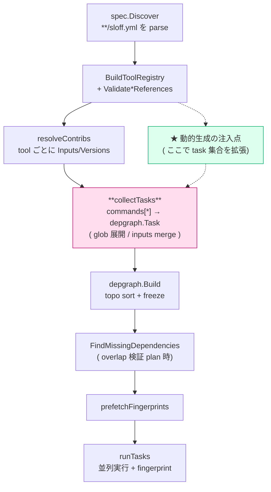
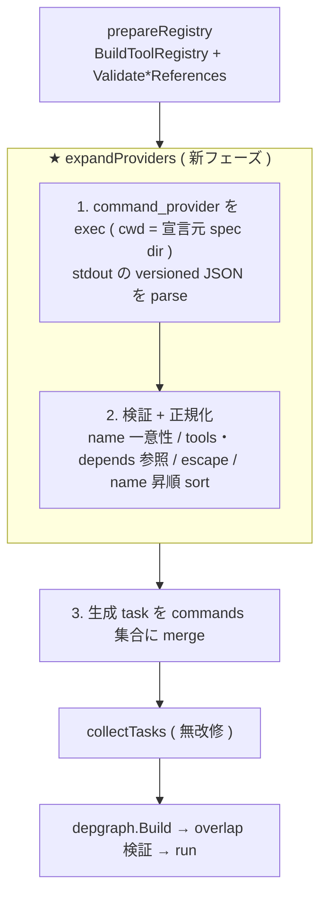

# 動的タスク ( Dynamic Task ) — 設計検討と方式比較

> Status: **確定・実装済み**。 [方式 2 ( `command_providers` )](#推奨) を [ADR-0015](../adr/0015-dynamic-tasks-via-command-providers.md) で finalized decision として確定し、 `internal/sloff/{spec,provider,runner}` に実装した。 本 doc は方式比較・競合調査の記録として残す ( 方式 0 / 1 / 3 / 4 / 5 は不採用)。

`sloff` の task は現状 **静的** である。 `**/sloff.yml` を discover し、 各 `commands[*]` をそのまま 1 task として materialize する ( `runner.collectTasks`)。 task の集合・各 task の `inputs` / `outputs` / `depends` は **spec ファイルに literal に書かれた内容で完全に確定**し、 実行前に freeze される ( = applicative build system )。

本 doc は「**task の集合や各 task の inputs を、 spec に literal で書くのではなく、 リポジトリの状態 ( ディレクトリ構成やソースの import グラフ) から導出したい**」という要求 ( = 動的タスク) に対して、

1. この要求が具体的に何を必要としているかを 2 つの軸に分解し ([要件の分解](#要件の分解--2-つの軸))、
2. 既存の競合ビルドツール / タスクランナーがこの問題をどう解いているかを徹底調査し ([競合調査](#競合調査--動的タスク機構の分類))、
3. sloff に落とし込む実現方式を複数案だして比較する ([実現方式の候補](#実現方式の候補))

ことを目的とする。

関連 ADR / design:
- [architecture.md](./architecture.md) — 全体アーキテクチャ。 本 doc は task 生成フェーズの拡張提案
- [ADR-0002](../adr/0002-fingerprint-hit-decision-model.md) — output-comparison ( 動的生成 task も同じ健全性条件を満たす必要がある)
- [ADR-0004](../adr/0004-spec-validation-and-output-conflict-policy.md) — spec validation / output conflict ( 生成 task にもそのまま適用される)
- [ADR-0005](../adr/0005-eliminate-resolver-auto-dispatch.md) — declared-only dispatch ( 動的生成も「暗黙の自動推論」に倒さない指針)
- [ADR-0006](../adr/0006-no-buf-specific-resolver-or-preflight.md) — buf を special-case しない ( 閉包計算を proto 専用にしない指針)
- [ADR-0013](../adr/0013-explicit-task-dependencies.md) — explicit depends + overlap 検証 ( 生成 task の健全性 safety net)

---

## Context / 背景

中〜大規模 monorepo の codegen では、 1 つの generator を **package / directory 単位の task に分割** ( per-dir incremental ) すると、 未変更 dir を fingerprint hit で SKIP でき、 warm run が大幅に速くなる。 さらに generator によっては、 per-dir task の `inputs` に **自 dir だけでなく、 そのソースが推移的に import している他 dir のソースまで含める** 必要がある ( import 先の型定義が変わると自 dir の出力も変わる generator のケース。 例: IDL の forward import 閉包)。

典型的には次のような task 群を作りたい:

```
codegen-<dir>      ( dir ごとに 1 task。 数十〜数百 task )
  inputs:  <dir>/**  +  <dir> が推移的に import する全 dir の **    ← 閉包は import グラフ由来
  outputs: gen/<dir>/**
```

この **task 集合**と各 task の **inputs 閉包**は、 ディレクトリ構成とソースの import 文から機械的に決まる。 これを `sloff.yml` に手書きするのは非現実的なので、 **現状は外部スクリプトで事前に per-dir の `sloff.yml` を生成してコミットしている**。

### 現状方式 ( 外部生成 + commit ) の課題

| # | 課題 | 説明 |
|---|---|---|
| C1 | **生成物のコミットノイズ** | 数十〜数百 task ぶんの `sloff.yml` が生成され git に乗る。 dir 追加 / import 変更のたびに巨大な diff |
| C2 | **閉包ロジックの out-of-band 化** | import 閉包を計算するスクリプトが sloff の外にあり、 sloff から見えない / fingerprint されない |
| C3 | **ドリフト** | 「スクリプトを再実行し忘れた `sloff.yml`」と「実際の import グラフ」がズレても sloff は気づけない。 生成 task が古い inputs のまま hit してしまう |
| C4 | **再現性が運用依存** | 生成スクリプトの実行が CI / 開発者の手順に埋め込まれ、 sloff の deterministic / OS 非依存保証 ( R2 / R3 ) の外側にある |

動的タスク機構は、 この task 生成を **sloff の関心事として first-class に取り込み**、 上記課題を構造的に解消できないか、 という検討である。

---

## 要件の分解 ( 2 つの軸)

「動的タスク」と一括りにすると設計を見誤る。 必要なものは直交する 2 軸に分解できる。

### 軸 A — parametric fan-out ( タスクの数 = データ由来)

1 つの task テンプレートを、 **ファイルシステム列挙で得た集合**にわたって展開する。 「`*.proto` を含む各 dir に対して 1 task」のような、 **生成 task の数と identity がディレクトリ構成から決まる**もの。

- 入力源: ファイルシステムの glob 列挙 ( ソースの**中身は読まない**)
- 難易度: 低。 Bazel macro / Make pattern rule / Gradle のループ生成と同型

### 軸 B — content-derived inputs ( inputs の中身 = データ由来)

各生成 task の `inputs` を、 **ソースの中身 ( import 文) を parse して計算した推移閉包**にする。 「task X の inputs = X の dir + X が推移的に import する全 dir」のような、 **inputs 集合がソースの import グラフから決まる**もの。

- 入力源: ソースファイルの**中身**を parse して構築した依存グラフ
- 難易度: 中〜高。 Pants の dependency inference / C の `gcc -M` 自動ヘッダ依存と同型

### 最重要の観察 — 軸 B の閉包は「ソース由来」なので applicative で足りる

軸 B は一見「task のグラフがデータに依存する = monadic ( 動的依存) build system が必要」に見える。 だが本ユースケースの import 閉包は **チェックイン済みソース ( = 実行前から存在するファイル) の中身**だけから決まり、 **どの task の出力にも依存しない**。

```
閉包 = f( ソースツリーの import 文 )       ← run 開始時点で確定
     ≠ g( 他 task が生成した中間生成物 )    ← こちらだと monadic 必須
```

したがって **閉包は plan フェーズ ( 実行前) に純粋関数として計算でき**、 sloff を「実行中に依存を発見する monadic build system」( Buck2 `dynamic_output` / Ninja `dyndep` / Shake `need` ) に作り変える必要は**ない**。 必要なのは **plan 時の "グラフ導出フェーズ"** だけで、 これは Nx Project Crystal / Pants dependency-inference / CMake configure / Bazel loading-macro と同じクラスの機構である。

> 例外: 将来「DSL から proto を生成し、 その生成 proto の import グラフから per-dir task を作る」ようなケースが出ると、 閉包が **task 出力由来**になり monadic が必要になる。 これは本 doc のスコープ外として [Open Questions](#open-questions) に記録する。

この観察が、 後述する方式比較で「過剰に強力な monadic 機構」を候補から落とす根拠になる。

---

## sloff 固有の制約 ( これを壊さないことが設計のゴール)

動的タスク機構は、 sloff の存在意義である **fingerprint の健全性**を一切損なってはならない。 設計の評価軸は「機能を満たすか」ではなく「下記をすべて維持できるか」である。

| # | 制約 | 動的タスクへの含意 |
|---|---|---|
| S1 | **fingerprint soundness** ( ADR-0002 ) | 生成 task の `input_hash` も「出力に影響する全入力」を捕捉せねばならない。 **閉包計算ロジック自体も入力**であり、 これが変われば下流が invalidate される必要がある |
| S2 | **determinism** ( R2 ) | 2 開発者が独立に動的生成しても **同一の task 集合・同一の input_hash** が出る必要がある。 task 生成は deterministic ( 列挙順固定 / timestamp 排除) でなければならない |
| S3 | **OS 非依存** ( R3 ) | 生成ロジックは OS 固有のパスや改行を埋め込んではならない |
| S4 | **applicative graph** | runner は `collectTasks` で task を materialize → `depgraph.Build` で freeze → 実行、 の順。 動的生成は **`collectTasks` より前 ( plan 時) に完了**し、 以降は既存経路に合流させたい ( 実行中の task 注入は避ける) |
| S5 | **buf / proto を special-case しない** ( ADR-0006 / ADR-0007 ) | 「proto の import を parse する閉包機能」を sloff 本体に直書きするのは指針に反する。 閉包計算は**汎用プリミティブ or 利用者側のロジック**として吸収したい |
| S6 | **declared-only** ( ADR-0005 ) | 動的生成も「暗黙に勝手に task が生える」のではなく、 spec に**明示宣言された生成器**から生える形にする |
| S7 | **overlap 検証が safety net** ( ADR-0013 ) | 生成 task も既存の overlap 検証 ( producer 出力 ∩ consumer inputs ) と producer 一意性検証 ( ADR-0004 D3 ) を**そのまま通す**。 これが「生成ロジックのバグで depends 漏れ / 出力衝突」を機械的に捕まえる |

特に **S4 と S7 が効く**: 動的生成を「`collectTasks` の手前で task 集合に注入し、 以降は通常 task と完全に同じ経路に流す」設計にすれば、 glob 展開 / depgraph / overlap 検証 / fingerprint / output-comparison がすべて**無改修で生成 task にも適用**される。 つまり sloff の健全性機構が動的生成 task を**ただで守ってくれる**。 これは inference を信頼するだけの Nx / Bazel に対する sloff の差別化点になりうる。

### sloff の現 task ライフサイクル ( 注入点の特定)



動的生成の注入点は **`Validate*References` の後・`collectTasks` の手前**。 ここで生成された task を spec / command 集合に足してから `collectTasks` に渡せば、 下流はすべて既存経路で処理される。

---

## 競合調査 — 動的タスク機構の分類

主要ビルドツール / タスクランナーの動的タスク機構を、 **「いつ展開するか ( phase )」** × **「何を導出できるか ( 軸 A / 軸 B / 出力由来の monadic )」** で整理する。

### 一覧表

| ツール | 機構 | 展開 phase | 軸A | 軸B | 出力由来<br/>(monadic) | 健全性の担保方法 |
|---|---|---|:--:|:--:|:--:|---|
| **Make** | pattern rule `%.o:%.c` / `$(wildcard)` / `$(eval)` | parse ( load ) | ○ | △ | × | 毎回 parse 時に wildcard / eval を再展開。 グラフが常に現 FS と一致 |
| **Make** | 自動ヘッダ依存 ( `gcc -MMD` → `.d` を `-include` ) | **2-pass** ( 前回出力を次回読込 ) | — | ○ | × | `.d` を毎回 `-include`。 発見した依存が次回の prerequisite になる |
| **CMake / GN / Meson** | configure → generate → build の 2 段。 `file(GLOB CONFIGURE_DEPENDS)` | configure ( build より前 ) | ○ | ○ | × | 生成器 ( build.ninja ) 自身を全 target の prerequisite に。 古いグラフでは build が走らない |
| **Ninja** | `dyndep` ( Fortran/C++ module 等 ) | **execution** | × | △ | ○ | 既存 build edge の implicit in/out のみ追加可。 新 edge は不可。 追加後に通常の dirty-check |
| **Bazel** | macro | loading | ○ | × | × | macro は analysis 前に消える。 純粋に rule instance を emit |
| **Bazel** | aspect ( dep edge を辿り action 伝播 ) | analysis | — | ○ | × | analysis では**ファイル内容を読めない** ( label のみ )。 内容依存は action へ ( digest でキャッシュ ) |
| **Pants** | dependency inference ( import を AST parse ) + `tailor` | rule graph ( exec 前 ) | ○ | ○ | × | engine が process を input digest でメモ化。 inference 結果も demand-driven にキャッシュ |
| **Nx** | Project Crystal ( `createNodesV2` / `createDependencies` ) | project graph 構築 ( exec 前 ) | ○ | ○ | × | plugin-options-hash + project-root-files-hash で createNodes 結果をキャッシュ / 無効化 |
| **Gradle** | `tasks.register` ループ + lazy provider | configuration ( exec 前 ) | ○ | △ | × | task ごとに declared in/out を fingerprint。 configuration cache でグラフ自体もキャッシュ |
| **sbt / Mill** | `Def.taskDyn` / `Task.traverse` | execution ( 親 task 評価時 ) | ○ | ○ | ○ | (定義コード + 発見した依存リスト + その hash) を key にする |
| **Buck2** | `dynamic_output` / `dynamic_actions` | **execution** ( 中間生成物を読んで action 生成 ) | — | ○ | ○ | 中間 artifact の内容変化が無ければ dynamic 関数を再評価せずキャッシュ |
| **Shake / redo** | `need` / `redo-ifchange` ( 実行中に依存宣言 ) | **execution** | ○ | ○ | ○ | 発見した依存リスト + mtime/hash を DB に記録。 リスト or 依存が変われば再実行 |

### 理論的フレーミング — applicative vs monadic ( Build Systems à la Carte )

Mokhov / Mitchell / Peyton Jones の "Build Systems à la Carte" の分類が、 この問題の本質を言い当てている:

- **applicative ( 静的依存 )**: 全 DAG を実行前に確定 ( Make / Ninja / Bazel / CMake )。 最大限の並列性と early-cutoff が得られるが、 **データ依存のエッジ ( 実行結果に応じて変わる依存 ) は表現できない**。
- **monadic ( 動的依存 )**: 実行中に `need` で依存を宣言でき、 グラフが実行とともに展開 ( Shake / redo / Buck2 dynamic_output / sbt taskDyn )。 任意の実行時ロジックを表現できるが、 **並列性が制限**され、 early-cutoff のために慎重な replay が要る。

健全性の定理: 「各ステップ後、 保存された全結果が記録された入力と整合する」とき build は sound。 **applicative でも monadic でも、 グラフをどう導出したか ( fan-out / 閉包 ) とは独立に、 最終的に各 task の input_hash が出力に影響する全入力を捕捉していれば sound** である。

### 調査からの結論 ( sloff への含意 )

1. **本ユースケース ( ソース由来の閉包 ) は applicative で十分**。 [要件の分解](#最重要の観察--軸-b-の閉包はソース由来なので-applicative-で足りる)の観察どおり、 plan 時にグラフを導出する Nx / Pants / CMake / Bazel-macro クラスで足り、 monadic ( Buck2 / Ninja dyndep / Shake ) は過剰。

2. **「誰がグラフを導出するか」で 4 つのモデルに分かれる**:
   - **(a) 宣言的展開**: spec 内の template/matrix を load 時に展開 ( Bazel macro / Make pattern / Gradle loop )。 → 軸 A 向き
   - **(b) 外部プロバイダ**: 利用者プログラムが task 一覧を吐き、 ツールが取り込む ( Nx plugin / Ninja の build.ninja 生成器 / CMake )。 → 軸 A+B
   - **(c) ネイティブ inference**: ツール本体が import を parse して閉包を作る ( Pants )。 → 軸 A+B だがツールが言語意味論に密結合
   - **(d) staged 再生成**: 普通の codegen task が spec 断片を出力し、 読み直す ( Make `.d` / CMake regen )。 → 軸 A+B、 本体は applicative のまま

3. **健全性は「フェーズ分離」で守られている**: どのツールも (i) 実行前にグラフを再生成しきる ( CMake / Bazel / Nx )、 または (ii) 実行中に発見した依存を次回のために記録する ( Make `.d` / Shake )、 のどちらか。 sloff も同じく **生成ロジック自体を fingerprint の入力に織り込む**ことで sound を保つ。

---

## 実現方式の候補

上記モデル (a)〜(d) を sloff に落とし込んだ候補を提示する。 各方式は共通フォーマット ( 概要 / sloff への配置 / 軸カバレッジ / 健全性 / 長所短所 ) で記述する。

### 方式 0 — 現状維持 ( 外部生成 + commit ) [ baseline ]

**概要**: 外部スクリプトで per-dir `sloff.yml` を生成し commit する ( 現状)。 sloff には何も足さない。

- **sloff への配置**: 変更なし。 生成済み `sloff.yml` を通常 discover
- **軸**: A ○ / B ○ ( スクリプトが何でもできる)
- **健全性**: 生成 `sloff.yml` がコミットされていれば、 各 task の inputs は通常どおり fingerprint される。 ただし **スクリプトと生成物のドリフト ( C3 ) は sloff の管轄外**
- **長所**: 実装ゼロ。 既に動いている
- **短所**: [現状の課題](#現状方式--外部生成--commit--の課題) C1〜C4 がそのまま残る。 評価の基準点として記載

---

### 方式 1 — 宣言的 matrix / template ( loading-phase 展開 )

**概要**: `sloff.yml` に **matrix ( fan-out 対象の集合 ) + template ( task 雛形 )** を書けるようにし、 sloff が load 時に展開する。 集合は **ファイルシステム glob 列挙**で与える。 Bazel macro / Make pattern rule / Gradle ループに相当。

```yaml
# 案: matrix で dir 集合を列挙し、 template を各 dir に展開する
generators:
  - name: codegen            # 生成器の名前 ( 生成 task 名の prefix )
    matrix:
      dir:                   # matrix 変数 dir = 下記 glob にマッチする各ディレクトリ
        dirs_containing: "**/*.proto"   # *.proto を含む dir を列挙 ( 中身は読まない)
    template:
      name: "codegen-{{ dir | slug }}"
      cmd: "buf generate --template buf.gen.yaml --path {{ dir }}"
      inputs:  ["{{ dir }}/**/*.proto", "buf.gen.yaml"]
      outputs: ["gen/{{ dir }}/**"]
      tools:   [buf]
```

- **sloff への配置**: spec parse 後の **expansion pass** を新設 ( `Validate*References` の前後 )。 `generators[*]` を展開し、 通常の `commands[*]` 集合に flatten してから既存経路へ。 注入点は [task ライフサイクル](#sloff-の現-task-ライフサイクル-注入点の特定)の★
- **軸**: A ○ / **B △** ( matrix 値は FS 列挙のみ。 import 閉包は表現できない。 inputs に固定の `../shared/**` を足す程度は可だが、 dir ごとに異なる推移閉包は不可)
- **健全性**:
  - 展開は deterministic ( glob 結果を sort )。 S2 / S3 を満たす
  - 各展開 task は通常 task と同一。 fingerprint / overlap 検証がそのまま効く ( S7 )
  - **template 自体が変われば、 展開 task の cmd / inputs が変わり input_hash も変わる** → 自然に invalidate。 dir の増減も task 集合の増減として反映
  - 注意: 「matrix の列挙ロジック ( glob pattern )」が変わって**集合のメンバーは同じだが意味が変わる**ケースは無い ( glob は純粋に FS 由来) ので、 軸 A の範囲では健全性ギャップは生じない
- **長所**: sloff-native で最も低リスク。 commit ノイズ ( C1 ) を解消。 外部スクリプト不要。 閉包不要な generator ( 自 dir のみで sound な es / go 系) は**これだけで完結**
- **短所**: **軸 B ( 推移閉包) を満たせない**。 閉包が要る generator ( pothos 系) には別途必要。 template DSL の表現力 ( 条件分岐 / cross-task depends の生成) を増やすと Bazel macro 的に肥大化するリスク

---

### 方式 2 — 外部 task-provider コマンド ( plan-time でグラフを吐く ) ★ 主軸候補

**概要**: 利用者が宣言した **task-provider プログラム**を sloff が plan 時に 1 回実行し、 標準出力に吐かれた **task 定義一覧 ( JSON )** を task 集合に取り込む。 provider は proto を parse して閉包を計算し、 per-dir task を inputs 込みで emit できる。 Nx Project Crystal ( createNodes ) / Ninja の build.ninja 生成器 / CMake に相当。 **現状の Python スクリプトを「commit する `sloff.yml` 生成器」から「sloff が呼ぶ task provider」に格上げする**もの。

```yaml
# 案: provider を宣言。 sloff が plan 時に exec して versioned JSON ( task 定義) を受け取る
command_providers:
  - name: proto-perdir
    exec: ["python3", "tools/emit-proto-tasks.py"]   # cwd = この sloff.yml の dir
```

provider が吐く JSON ( 各要素が 1 task ):

```json
[
  { "name": "codegen-foo-v1",
    "cmd": "buf generate --template buf.gen.pothos.yaml --path foo/v1",
    "inputs":  ["foo/v1/**/*.proto", "bar/v1/**/*.proto", "baz/v1/**/*.proto"],
    "outputs": ["gen/foo/v1/**"],
    "tools": ["buf"],
    "depends": [] },
  { "name": "codegen-bar-v1", "...": "..." }
]
```

- **sloff への配置**: [task ライフサイクル](#sloff-の現-task-ライフサイクル-注入点の特定)の★に **provider 実行フェーズ**を新設。 provider 出力を parse → `spec.Command` 相当に変換 → 通常 task 集合に merge → 以降は無改修の既存経路 ( glob 展開 / depgraph / overlap 検証 / fingerprint )
- **軸**: **A ○ / B ○** ( provider が何でも計算できる。 閉包も depends 生成も可)
- **健全性** ( [後述の深掘り](#方式-2-の-fingerprint-健全性-深掘り)参照):
  - **生成 task は emit された `(cmd, inputs, tools)` だけで自己完結**。 provider は plan 時に「task 定義を選ぶ」だけで実行時には走らないので、 **provider の version を生成 task の fingerprint に含める必要はない** ( provider が別定義を吐けば cmd / inputs が変わり自然に invalidate する)
  - provider は **毎 `sloff run` 実行**する純粋関数として扱う ( v1 はメモ化なし)。 これにより「閉包ロジックを直したが古い inputs で hit」( C3 ドリフト) は構造的に起きない ( 毎回現状から再 emit するため)
  - 生成 task は通常 task と同一経路 → overlap 検証 ( ADR-0013 ) / producer 一意性 ( ADR-0004 D3 ) がそのまま効き、 **provider のバグ ( depends 漏れ / 出力衝突) を機械的に検出**
  - determinism: sloff 側で生成 task を name で sort、 重複 name を reject、 非決定的出力を弾く ( S2 )
- **長所**:
  - **軸 A+B を単一機構で満たす**。 既存の**閉包ロジックをそのまま provider に転用**でき、 移行コストが最小
  - **proto を special-case しない** ( S5 / ADR-0006 と整合)。 sloff は「JSON で task を受け取る」だけで、 閉包の意味論は provider 側
  - C1 ( commit ノイズ) / C2 ( out-of-band) / C3 ( ドリフト) / C4 ( 再現性) を**すべて解消**。 provider が sloff の plan に組み込まれ、 deterministic 経路に乗る
- **短所**:
  - **plan 時に毎回 provider subprocess + ソース parse のコスト**を払う ( v1 はメモ化しない)。 ただし閉包計算は import 行の scan で済み、 setup への上乗せは限定的の見込み ( 実測は [OQ5](#open-questions))
  - provider が undeclared input を読んで閉包を計算すると不健全 ( 後述ギャップ)。 これは ADR-0002 の前提と同クラスで、 現状方式 0 も同じリスクを持つ ( 純増ではない)
  - 新しい spec 概念 ( `command_providers` ブロック / provider 出力スキーマ) の追加

---

### 方式 3 — ネイティブ閉包プロバイダ ( pluggable inference )

**概要**: sloff 本体に **汎用の "閉包プロバイダ" 拡張点** ( resolver / storage と同じ plugin パターン) を設け、 spec から `inputs_closure` プリミティブで呼ぶ。 言語別 inference ( proto-imports / ts-imports ) を provider として実装。 Pants の dependency inference に相当。

```yaml
generators:
  - name: codegen
    matrix:
      dir: { dirs_containing: "**/*.proto" }
    template:
      name: "codegen-{{ dir | slug }}"
      cmd: "buf generate --path {{ dir }}"
      inputs_closure:                    # ← ネイティブ閉包プリミティブ
        provider: proto-imports          # Go で実装した閉包プロバイダ
        roots: ["{{ dir }}"]
        direction: forward
      outputs: ["gen/{{ dir }}/**"]
```

- **sloff への配置**: `toolresolver.Resolver` 同様の `ClosureProvider` interface + registry。 `collectTasks` の inputs 展開時に closure provider を呼ぶ
- **軸**: A ○ / B ○
- **健全性**: 閉包は plan 時にソースから確定するので、 方式 2 同様 **生成 task は emit された inputs で自己完結**する ( closure provider の version 注入は不要)。 closure provider は run 内メモ化
- **長所**: 利用者にとって最もエルゴノミック ( YAML だけで閉包が書ける)。 inference 結果を sloff が直接持つので、 将来 overlap 検証を file 粒度に高精度化する余地 ( architecture.md Open Q3 ) と相性が良い
- **短所**:
  - **ADR-0006 / ADR-0007 の指針に正面から反する**。 sloff 本体に proto ( 次いで ts / go ...) の parser を抱え込み、 言語ごとに拡張点が増える。 sloff の「汎用プリミティブで完結」思想と衝突
  - もし「built-in provider をゼロにして利用者に実装させる」なら、 それは実質 **方式 2 を Go API ( in-process plugin ) でやる版**になり、 subprocess 境界が無いぶん配布・差し替えが固くなる
  - 最も実装が重い

---

### 方式 4 — staged spec 再生成 ( codegen task が spec 断片を出力 )

**概要**: **普通の sloff task** が `generated/*.sloff.yml` ( per-dir task 定義) を出力する。 sloff はそれを ( 再 ) discover して残りを実行。 Make の `.d` を `-include` / CMake が build.ninja を作り直すのと同型。 「spec を生成する」ことを **ただの codegen として扱う**。

2 つの運用形態:
- **4a ( 2-invocation )**: `sloff run` を 2 回。 1 回目で spec 断片を生成 ( これ自体が fingerprint され、 import グラフ不変なら hit して即終了)、 2 回目で本体。 生成 spec は commit or gitignore
- **4b ( 内部 re-plan )**: 1 回の `sloff run` 内で「spec 生成 task 群を先に走らせ → spec を再 discover → 残りを plan して実行」の固定点を回す。 Ninja の「生成器を全 edge の prerequisite にする」の sloff 版 ( 限定的な monadic ステップ)

- **sloff への配置**: 4a は本体ほぼ無改修 ( 運用ルールのみ)。 4b は runner に「spec 生成フェーズ → re-discover → 本体フェーズ」の段構えを追加
- **軸**: A ○ / B ○
- **健全性**: 生成 spec 断片は**普通の output**。 output-comparison でそのまま fingerprint される。 import グラフ不変なら生成 task が hit し、 再生成が走らない ( = 速い)。 健全性は既存機構で自動的に成立
- **長所**: sloff core を applicative のまま保てる ( 4a は実質ゼロ改修)。 「動的部分はただの codegen task」という最小概念。 移行パス / 他方式の fallback として優秀
- **短所**:
  - 4a は **2 回起動の運用**が前提。 生成 spec を commit するなら C1 ( ノイズ) が残る ( ただし sloff が生成・fingerprint する点で C2/C3/C4 は改善)
  - 4b は runner に re-plan を持ち込み、 「plan は 1 回」という現モデルを崩す ( 限定 monadic 化)。 実装が方式 2 より重くなりがち

---

### ( 参考 ) 方式 5 — 完全 monadic な実行時動的依存

Buck2 `dynamic_output` / Ninja `dyndep` / Shake `need` のように、 **実行中に中間生成物を読んで依存・task を発見**する機構。 [最重要の観察](#最重要の観察--軸-b-の閉包はソース由来なので-applicative-で足りる)のとおり、 本ユースケースの閉包は**ソース由来で plan 時に確定**するため**過剰**。 「生成 proto の import から閉包を作る」等の将来要求が出たときのみ検討対象。 現時点では候補から外す。

---

## 比較表

| 観点 | 0: 現状維持 | 1: matrix/template | **2: 外部 provider** | 3: ネイティブ inference | 4: staged 再生成 |
|---|:--:|:--:|:--:|:--:|:--:|
| 軸 A ( fan-out ) | ○ | ○ | ○ | ○ | ○ |
| 軸 B ( 推移閉包 ) | ○ | **×** | ○ | ○ | ○ |
| cross-task depends 生成 | ○ | △ | ○ | △ | ○ |
| commit ノイズ解消 (C1) | × | ○ | ○ | ○ | △ (4a commit時×) |
| 閉包ロジックを fingerprint (C2/C3) | × | n/a | ○ | ○ | ○ |
| determinism/OS非依存を sloff が保証 (C4) | × | ○ | ○ | ○ | ○ |
| 既存ロジック ( Python ) 流用 | ○ | × | **○** | × | ○ |
| ADR-0006 ( proto を special-case しない) 整合 | ○ | ○ | **○** | **×** | ○ |
| sloff core を applicative 維持 (S4) | ○ | ○ | ○ | ○ | △ (4b で re-plan) |
| overlap 検証が生成 task に効く (S7) | ○ | ○ | ○ | ○ | ○ |
| plan latency への影響 | なし | 小 | 中 ( 毎 run 実行) | 中 | 小〜中 |
| 実装コスト | ゼロ | 小 | 中 | 大 | 小 (4a) / 中 (4b) |

---

## 推奨

### 結論: 方式 2 ( `command_providers` ) 一本で進める

閉包 ( 軸 B ) を含む per-dir codegen を first-class に扱うには **方式 2 ( 外部 command provider )** が最も筋がよい。 移行パス ( 方式 4 ) や静的展開 ( 方式 1 ) との併用は採らず、 方式 2 に集約する。

採用理由:
- **軸 A+B を単一機構で満たす**。 fan-out も推移閉包も depends 生成も provider 側で計算でき、 既存の閉包計算ロジックをそのまま provider に転用できる ( 課題 C1〜C4 を一括解消)
- **proto を special-case しない** ( ADR-0006 / S5 と整合)。 sloff は「versioned JSON で task 定義を受け取る」汎用プリミティブだけを持ち、 閉包の意味論は provider 側に閉じる
- **生成 task は通常 task と完全に同一経路**を流れる ( S4 )。 glob 展開 / depgraph / overlap 検証 ( S7 ) / fingerprint / output-comparison が無改修で適用され、 sloff の健全性機構が provider のバグ ( depends 漏れ / 出力衝突) を機械的に捕まえる
- **生成 task の fingerprint は emit された `(cmd, inputs, tools)` で自己完結**するため、 provider 自身を fingerprint に織り込む必要がなく、 機構が最小で済む ( [健全性深掘り](#方式-2-の-fingerprint-健全性-深掘り))

不採用:
- **方式 1 / 方式 3 / 方式 4**: 方式 1 は軸 B を満たせず、 方式 3 は ADR-0006/0007 に反し ( proto parser を本体に抱える)、 方式 4 は plan 1 回モデルを崩す。 いずれも方式 2 の上位互換にならない
- **方式 5 ( monadic )**: ソース由来閉包には過剰。 将来「task 出力由来の閉包」要求が出たら再評価 ( [OQ1](#open-questions))

### 実装方針 ( 方式 2 )

```
1. spec:     command_providers ブロックの parse / validate を追加 ( internal/sloff/spec )
2. provider: 宣言元 spec dir を cwd に exec → versioned JSON を parse ( internal/sloff/provider )
3. inject:   生成 task を name 昇順 sort + 一意性 / 参照 / escape 検証 → commands 集合に merge
             ( prepareRegistry の後・collectTasks の手前 = expandProviders フェーズ )
4. 以降:     既存経路 ( collectTasks → depgraph.Build → overlap 検証 → run ) に無改修で合流
5. test:     E2E golden で動的生成特有の回帰を網羅 ( 後述 E2E テスト戦略 )
```

provider は毎 `sloff run` 実行する純粋関数として扱う ( v1 はメモ化なし。 [健全性深掘り](#方式-2-の-fingerprint-健全性-深掘り) 参照)。

---

## 方式 2 の fingerprint 健全性 ( 深掘り )

方式 2 は sloff の差別化点 ( fingerprint 健全性) に直結するので、 soundness の議論を独立に詰める。

### 何を input_hash に織り込むか ( 結論: provider の version は不要 )

生成 task T ( inputs = 閉包 I_T、 cmd = C_T ) の `input_hash` は、 **既存の式そのまま**で十分:

```
input_hash(T) = H( files_hash(I_T), cmd_hash(C_T), resolved_versions_hash(T) )
                                                    └ T.tools の version だけ。 provider の version は含めない
```

理由 ( 重要): **provider は plan 時に「task 定義を選ぶ」だけで、 実行時に走るのは `cmd` ( 例: `buf generate …`) であって provider ではない**。 したがって task 定義 `(cmd, inputs, tools)` がいったん確定すれば、 その出力は provider の version とは因果的に無関係 ( ADR-0002 の「generator は宣言 inputs の純関数」前提下)。 provider のロジック変更を 2 ケースに分けると:

| provider ロジック変更の結果 | 何が起きるか | 検知経路 |
|---|---|---|
| T に**別の** `(cmd, inputs)` を吐くようになった | cmd_hash / files_hash が変わる | **既存経路で自然に invalidate** |
| T に**同一の** `(cmd, inputs)` を吐く | T の出力は不変 ( 純関数) なので **再生成不要が正しい** | 何も起きなくてよい |

どちらのケースも provider version の注入を必要としない。 「provider fingerprint を生成 task に注入する」は**不要であり、 当初案からは撤回する**。 ソースや閉包の変化はすべて files_hash 経路で捕捉される:

| 変化 | 何が動くか | 検知経路 |
|---|---|---|
| ソースの import が変わり閉包メンバーが変わった | provider が再 emit → I_T の集合が変わる → files_hash | 既存 files_hash 経路 |
| 閉包内のソースの中身が変わった | I_T の files_hash が変わる | 既存 files_hash 経路 |
| provider のロジックが変わり別定義を吐く | cmd / inputs が変わる | 既存 cmd_hash / files_hash 経路 |

### provider は毎 run 実行する純粋関数 ( v1 はメモ化なし )

C3 ドリフト ( 閉包ロジックを直したのに古い inputs で hit ) を塞ぐ鍵は、 **provider を毎 `sloff run` 実行して現状から task 集合を再 emit する**こと。 v1 では provider 出力の run 跨ぎメモ化は持たない:

- メモ化を入れると「provider が読む全ソース」を宣言させ ( メモ化キー)、 その over-approx が外れると新 dir を取りこぼす、 という新たな failure mode を抱える。 健全性の surface を増やす
- 閉包計算は import 行の scan で済むため、 毎回走らせても安い見込み。 まず always-rerun で sound に作り、 plan-time コストが実測で問題化したら opt-in メモ化を別途設計する ( architecture.md Open Q4 の「benchmark してから最適化」と同じ規律。 [OQ4](#open-questions) / [OQ5](#open-questions))
- run **内**での重複評価回避 ( 同じ provider を複数 spec が参照する等) は無害なので行う ( SourceLister の run 内メモ化と同列)

### determinism の強制 ( S2 / R2 )

- provider 出力を sloff 側で **name 昇順に sort**してから取り込む ( provider の出力順に依存しない)
- **重複 name を reject** ( load error )
- provider 出力に timestamp / 絶対パス / OS 固有表現が混ざらないことを検証 ( 既存の glob escape チェックと同様、 repoRoot を抜ける path は弾く)
- provider が deterministic である限り、 2 開発者は同一 task 集合 → 同一 input_hash → 同一 record ( R2 )。 provider 自身の再現性は利用者責務 ( [OQ3](#open-questions))

### 既知のギャップ ( 現状方式と同クラス、 純増ではない )

- **provider が undeclared input を読んで閉包を計算**した場合 ( 例: provider が宣言外のファイルを参照)、 その入力変化は sloff から見えず invalidate されない。 これは ADR-0002 の「generator は宣言 inputs 以外を読まない」前提と**同クラス**であり、 provider 自身の `inputs` 宣言を SSoT にすることで縮小する
- **provider が閉包を過小報告** ( 推移 import を 1 つ取りこぼす) した場合、 その取りこぼした dir のソース変化で生成 task が invalidate されない。 ただしこのギャップは:
  - 取りこぼした入力が**他 task の output**なら **overlap 検証 ( ADR-0013 ) が検出**する ( producer 出力 ∩ consumer inputs )
  - 取りこぼした入力が**純ソース**なら、 down-stream の compile ( 型不整合) で顕在化する。 これは per-dir 化が既に受け入れている tradeoff ( architecture.md の buf-go / es per-dir の「自 dir inputs の既知ギャップ」) と同一で、 **動的化で新たに悪化するものではない**

---

## 方式 2 の実装詳細 ( provider のライフサイクルと型 )

レビューを踏まえ、 主軸候補である方式 2 を実装レベルまで詰める。 設計の基本方針は **「provider フェーズで生成 task を `spec.Command` 相当に変換し、 `collectTasks` の手前で既存 task 集合に merge する。 以降は無改修の既存経路に流す」**。 これにより glob 展開 / depgraph / overlap 検証 / fingerprint / output-comparison が**生成 task にも自動適用**される ( S4 / S7 )。

### runner への組み込み ( 新フェーズ `expandProviders` )

現 `Run()` の `prepareRegistry` ( = `BuildToolRegistry` + `Validate*References` ) と `collectTasks` の間に **provider 展開フェーズ**を 1 つ挿す。 生成 task は **`command_providers[*]` を宣言した spec の relpath に属する** ( fingerprint Key のパス `.sloff/fingerprints/<spec_relpath>/<task_id>/` が安定し deterministic になる )。



`graph` / `plan` 経路でも provider は展開する ( task 集合が変わるため)。 provider は version 解決もメモ化も伴わない単純な exec なので、 `run` / `graph` のどちらでも同じ展開結果になる。

### provider 出力の型契約 ( versioned envelope )

provider は stdout に **schema_version 付きの JSON** を吐く。 各 task は `spec.Command` を 1:1 で写像した形:

```json
{
  "schema_version": "v1",
  "tasks": [
    {
      "name": "codegen-foo-v1",
      "cmd": "buf generate --template buf.gen.pothos.yaml --path foo/v1",
      "inputs":  ["foo/v1/**/*.proto", "bar/v1/**/*.proto"],
      "outputs": ["gen/foo/v1/**"],
      "tools":   ["buf"],
      "depends": [{ "spec": "", "task": "registry" }]
    }
  ]
}
```

契約と検証ルール:

- **path 基準は手書き spec と同一** ( = provider を宣言した spec dir 相対、 ADR-0008 D3 )。 provider は「どの spec dir に属する task か」を意識せず、 宣言元 dir 相対でパスを書けばよい
- `name` は provider 内で一意。 sloff 側で **他 provider / 静的 `commands[*]` を含めた全 task 名の一意性**を検証 ( 重複は load error )
- `tools` は既存の `ToolRegistry` ( repo-wide flat namespace ) を引く名前リスト。 未定義参照は load error ( 既存 `ValidateToolReferences` をそのまま通す )
- `depends` も既存 `spec.Depend` と同形。 `ValidateDependReferences` 相当の検証をそのまま通す
- 絶対パス / repoRoot を抜ける path / OS 固有表現は **既存 `glob.EscapesRoot` で弾く**
- `schema_version` が未知なら load error ( fingerprint schema ADR-0009 と同じ「跨ぎ互換読み込みはしない」方針 )

### Go 型 ( spec 宣言 + 実行 )

v1 の provider は「exec して JSON を読む」単一機構なので、 大げさな plugin interface は要らない。 spec 側の宣言型と、 それを展開する関数だけで足りる:

```go
// internal/sloff/spec/spec.go — command_providers[*] の宣言
type CommandProviderDecl struct {
    Name string   `yaml:"name"`
    Exec []string `yaml:"exec"`   // plan 時に cwd=specDir で実行
}

// internal/sloff/provider/provider.go — 実行と展開
// Expand は provider を exec し、 stdout の versioned JSON を 0 個以上の Command に変換する。
// specDir は provider を宣言した spec の dir ( 実行 cwd かつ emit path の基準、 ADR-0008 D3 )。
func Expand(ctx context.Context, specDir string, decl spec.CommandProviderDecl) ([]spec.Command, error)
```

- 返り値は `[]spec.Command` のみ。 [健全性深掘り](#何を-input_hash-に織り込むか--結論-provider-の-version-は不要-)のとおり provider の version は不要なので `Result` 型も注入経路も持たない
- 将来 exec 以外の provider 機構 ( 例: in-process Go plugin) が要るなら、 その時点で `resolver` / `storage` と同じ `interface + Registry` に一般化すればよい。 v1 では過剰なので入れない

### 生成 task の合流 ( fingerprint 経路は無改修 )

生成 task は `r.byKey` ( `depgraph.TaskRef → taskInfo` ) に通常 task と同じく載り、 input_hash 計算 / prefetch / lookup / store はすべて既存経路を流れる。 [健全性深掘り](#何を-input_hash-に織り込むか--結論-provider-の-version-は不要-)のとおり provider 由来の追加入力は無いので、 runner の fingerprint 機構には一切手を入れない。

### plan latency ( v1 はメモ化しない )

provider は毎 `sloff run` 実行する。 これが setup ( 既に支配項) にどれだけ乗るかは [OQ5](#open-questions) で実測する。 閉包計算は import 行の scan で済む見込みで、 v1 では run 跨ぎメモ化を入れない ( メモ化は新たな soundness surface を生むため、 必要性が実測で確認できてから opt-in で設計する → [OQ4](#open-questions))。

### 決定性の強制と失敗モード

| 事象 | sloff の挙動 |
|---|---|
| provider 出力順がブレる | sloff 側で **name 昇順 sort** してから取り込む ( 出力順に非依存、 R2 ) |
| 生成 task 名が重複 | load error ( generator 内 / generator 間 / 静的 commands との衝突すべて ) |
| 生成 task の path が repoRoot を抜ける / 絶対パス | load error ( 既存 `glob.EscapesRoot` ) |
| provider が非ゼロ終了 | run を fail ( codegen task の失敗と同じ。 record は書かない ) |
| 不正 JSON / 未知 schema_version | load error |
| provider が出力衝突 task を吐く | **既存 ADR-0004 D3 ( producer 一意性 ) が検出** → fail |
| provider が depends 漏れ task を吐く | **既存 overlap 検証 ( ADR-0013 ) が plan 時 / run 時に検出** → fail |
| provider 出力の非決定性疑い | `--check` mode ( 任意 ) で provider を 2 回実行し diff。 CI ガード ( Pants `tailor --check` 相当 ) |

最後の 2 行が重要で、 **provider のバグ ( 閉包の depends/出力の誤り ) は sloff の既存健全性機構がそのまま捕まえる**。 利用者は「正しい task を吐く」ことだけに集中でき、 「健全な fingerprint になっているか」は sloff が保証する。 これは inference を信頼するだけの Nx / Bazel に対する sloff の差別化点。

### E2E テスト戦略 ( 本プロジェクトの主防御線 )

`testdata/e2e/runner/<case>/{initial,expected}` の golden で、 動的生成特有の経路を網羅する ( CLAUDE.md の E2E 必須方針 )。 provider は fixture 内の固定スクリプト ( deterministic ) を置く:

| ケース | 検証内容 |
|---|---|
| `provider-first-run-writes-records` | provider が N task を吐き、 全 task が RUN、 record が `<spec_relpath>/<生成名>/` に書かれる |
| `provider-second-run-hits` | warm run で provider は再実行されるが同一 task 集合を再 emit → 全生成 task が SKIP ( output-comparison ) |
| `provider-closure-grows-invalidates` | あるソースに import を 1 つ足す→ provider が当該 task の inputs を拡大 emit → **その task だけ RUN、 他は SKIP** |
| `provider-task-set-changes` | proto dir を 1 つ追加→ provider が新 task を emit → 新 task のみ RUN、 既存は SKIP |
| `provider-logic-change-reemits` | provider のロジックを変え別 `(cmd, inputs)` を吐く→ 該当 task が cmd_hash / files_hash 経路で invalidate ( **provider version の注入なしで成立**) |
| `provider-output-conflict-fails` | provider が同一 output を持つ 2 task を吐く→ ADR-0004 D3 で fail |
| `provider-missing-depends-fails` | provider が producer/consumer overlap を depends 無しで吐く→ ADR-0013 検証で fail |
| `provider-determinism` | provider 出力順をシャッフルしても record が byte-identical ( R2 ) |

`provider-closure-grows-invalidates` と `provider-logic-change-reemits` の 2 つが、 動的タスクが**静的 task では作れない**回帰ケース ( 前者は閉包の正しい invalidate、 後者は provider version 不要の実証) であり、 最優先で用意する。

---

## spec スキーマ案 ( `command_providers` ブロック )

provider を `command_providers` トップレベルブロックで宣言する。 各 entry は名前付きの実行コマンド ( = plan 時に走り、 versioned JSON で task 定義を吐くプログラム):

```yaml
# <spec_dir>/sloff.yml
tools:
  buf: { exec: ["buf", "--version"] }

command_providers:
  # plan 時に exec され、 stdout に versioned JSON ( task 定義一覧) を吐く。
  # cwd は この sloff.yml の dir。 emit する path も同 dir 相対 ( ADR-0008 D3 )。
  - name: proto-perdir
    exec: ["go", "run", "./tools/emit-proto-tasks"]

commands:
  # 静的 task も従来どおり共存できる
  - name: registry
    cmd: "buf build -o registry.binpb"
    inputs: ["**/*.proto"]
    outputs: ["registry.binpb"]
    tools: [buf]
```

- `command_providers[*]` は `expandProviders` フェーズで実行され、 出力 task が `commands[*]` 相当に展開されてから既存の `ToolRegistry` / `depgraph` / overlap 検証 / fingerprint 経路に合流する
- provider が emit する task は **通常 task と同一**に扱う ( = sloff core の改修は `expandProviders` フェーズに局所化)
- v1 では provider に `inputs` / version 宣言は持たせない ( 毎 run 実行・生成 task は自己完結。 [健全性深掘り](#方式-2-の-fingerprint-健全性-深掘り))。 将来メモ化を入れる場合のみ「provider が読むソース」の宣言を opt-in で追加する ( [OQ4](#open-questions))

---

## Open Questions

- **OQ1 ( monadic 化の要否 )**: 「DSL → proto 生成 → その生成 proto の import から閉包」のように **閉包が task 出力由来**になる要求は出るか。 出るなら方式 5 ( Buck2 dynamic_output / staged re-plan ) の限定導入を再評価する。 現時点はソース由来のみ想定し applicative で確定
- **OQ2 ( provider 出力スキーマの版管理 )**: provider が吐く JSON task スキーマ ( `schema_version`) を sloff 側でどう version 管理するか。 fingerprint schema ( ADR-0009 ) と同様に wire 互換を破る変更時の運用を決める
- **OQ3 ( provider の再現性 )**: v1 は provider を毎 run 実行し fingerprint に含めないため、 provider 自身の version 固定 ( 例: `go run` の toolchain / 依存) は利用者責務。 provider が non-deterministic だと R2 が崩れる。 spec lint / `--check` mode ( 2 回実行 diff、 Pants `tailor --check` 相当) でどこまで担保するか
- **OQ4 ( メモ化の opt-in 設計 )**: plan-time コストが実測で問題化した場合に入れる run 跨ぎメモ化の設計。 メモ化キー ( provider が読むソースの宣言) の over-approx 健全性、 置き場 ( `$XDG_CACHE_HOME` / remote 共有)、 cold start 短縮の要否
- **OQ5 ( plan latency の実測 )**: provider 実行 + ソース parse が warm run の setup ( 既に支配項) にどれだけ乗るか。 import 行 scan で十分安いか、 メモ化が要るほどかを benchmark で確かめる ( architecture.md Open Q4 と同じ規律)
- **OQ6 ( overlap 検証の O(N²) )**: 動的生成で task 数が数百規模になると overlap 検証の O(N²) が効いてくる ( architecture.md 実装上の留意点)。 生成 task 群に対する交差判定を dir prefix で枝刈りする最適化が要るか

---

## 関連

- 競合機構の一次情報:
  - Build Systems à la Carte ( Mokhov / Mitchell / Peyton Jones ) — applicative vs monadic の分類
  - Nx Project Crystal ( `createNodesV2` / `createDependencies` ) — plan 時グラフ導出 + キャッシュ
  - Pants dependency inference / `tailor` — import parse による閉包
  - Bazel macro / rule / aspect — loading/analysis フェーズ分離、 analysis で内容を読まない原則
  - Ninja `dyndep` / Buck2 `dynamic_output` / Shake `need` — 実行時 monadic ( 本ユースケースには過剰)
  - Make pattern rule / 自動ヘッダ依存 ( `.d` ) / CMake configure — 2-pass 生成器の健全性
- sloff 内部:
  - `internal/sloff/runner/runner.go` `collectTasks` — 生成 task の合流点 ( ★ `expandProviders` はこの手前)
  - `internal/sloff/spec/` — `command_providers` ブロックの parse / validate を追加する箇所
  - `internal/sloff/provider/` ( 新規 ) — provider の exec / versioned JSON parse / 検証
  - `internal/sloff/depgraph/` — 生成 task もそのまま流す DAG 構築 + overlap 検証
